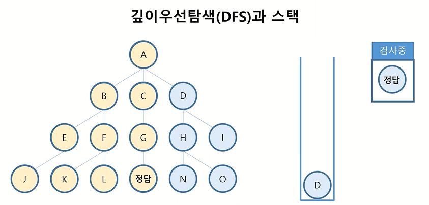
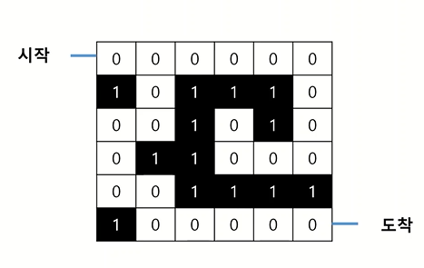
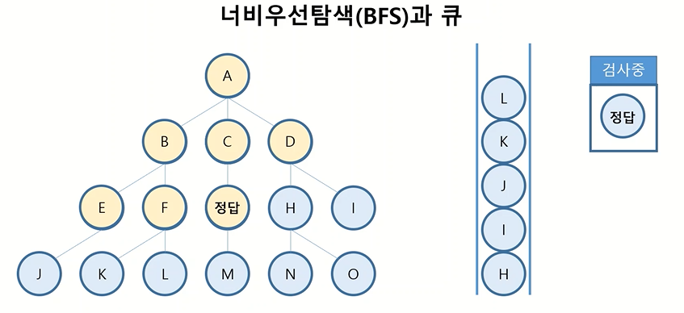
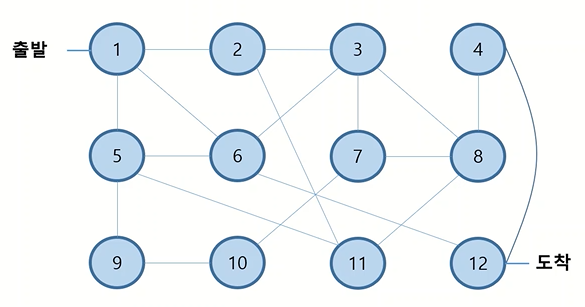

# 1. 깊이우선탐색 (Depth First Search)

하나의 경우에 수에 대한 모든 경우의 수를 조사하고, 다음 경우의 수를 조사하면서 해를 찾는 과정


## 1) 깊이우선탐색과 스택

- A부터 검사 → A가 정답 아님 → A 아래 경우의 수 B, C, D를 스택에 담음
- **스택 가장 마지막 데이터인** B를 꺼내 검사 → B가 정답 아님 → B 아래 경우의 수 E, F를 스택에 담음

- 스택 가장 마지막 데이터인 E를 꺼내 검사 → E가 정답 아님 → E 아래 경우의 수 J를 스택에 담음
- ... 반복 ...
- 검사하는 값이 정답이라면 알고리즘 종료




## 2) 깊이우선탐색 예제
### ✅ 미로찾기
Q. 주어진 미로가 탈출 가능한 미로라면 True, 탈출 불가능한 미로라면 False를 반환



- 갈 수 있는 지점은 0, 갈 수 없는 지점은 1로 해서 맵을 그림
  - 각 지점의 좌표는 (세로인덱스, 가로인덱스)로 표시함
- 시작점 (0,0)부터 검사 → (0,0)은 도착점이 아님 → 이동할 수 있는 모든 경우의 수(0,1)를 스택에 담음 
- 스택 가장 위에 있는 (0,1)을 꺼내 검사 → (0,1)은 도착점이 아님 → 이동할 수 있는 모든 경우의 수 (0,2), (1,1)을 스택에 담음
- ... 반복 ...

```python
maze = [
    [0,0,0,0,0,0],
    [1,0,1,1,1,0],
    [0,0,1,0,1,0],
    [0,1,1,0,0,0],
    [0,0,1,1,1,1],
    [1,0,0,0,0,0]
]

def solution(maze):
    width = len(maze[0]) -1
    height = len(maze) - 1
    dest = (height, width) # 도착지점의 (세로좌표, 가로좌표)
    stack = [(0,0)]  # 출발지점을 스택에 담아놓고 시작
    maze[0][0] = 2  # 이미 방문한 위치임을 0이나 1이 아닌 숫자로 표시
    
    while stack:
        now = stack.pop()  # 스택의 가장 마지막 데이터 추출해서 검사
        if now == dest:  # while 반복문 종료조건
            return True
        
        x = now[1] # now의 가로 좌표
        y = now[0] # now의 세로 좌표
        
        # 왼쪽으로 이동할 수 있다면
        if x-1 > -1 and maze[y][x-1] == 0:
            stack.append((y, x-1))  # 이동할 수 있는 좌표라면 스택에 담음
            maze[y][x-1] = 2  # 이미 방문한 위치임을 표시
        # 오른쪽으로 이동할 수 있다면
        if x+1 < width and maze[y][x+1] == 0:
            stack.append((y, x+1))
            maze[y][x+1] = 2
        # 위쪽으로 이동할 수 있다면
        if y-1 > -1 and maze[y-1][x] == 0:
            stack.append((y-1, x))
            maze[y-1][x] = 2
        # 아래쪽으로 이동할 수 있다면
        if y+1 < height and maze[y+1][x] == 0:
            stack.append((y+1, x))
            maze[y+1][x] = 2
        
    # 스택에 더이상 이동할 수 있는 좌표가 없으면 탈출 불가능한 미로임
    return False       


```


-----------------------


# 2. 너비우선탐색 (Breadth First Search)

하나의 경우에 수에 대한 같은 레벨의 모든 경우의 수를 조사한 후, 다음 레벨의 경우의 수를 조사하면서 해를 찾는 과정


## 1) 너비우선탐색과 큐
- 첫번째 레벨 A부터 검사 → A가 정답 아님 → 다음 레벨의 모든 경우의 수 B, C, D 큐에 담음  : 큐 [B,C,D]
- **큐 가장 앞에 있는** B를 꺼내 검사 → B 정답 아님 → B 아래 다음 레벨의 모든 경우의 수 E, F 큐에 담음  : 큐 [C, D, E, F]
- 큐 가장 앞에 있는 C를 꺼내 검사 → C 정답 아님 → C 아래 다음 레벨의 모든 경우의 수 '정답' 큐에 담음 : 큐 [D, E, F, 정답]
- 큐 가장 앞에 있는 D를 꺼내 검사 → D 정답 아님 → D 아래 다음 레벨의 모든 경우의 수 H, I 큐에 담음 : 큐 [E, F, 정답, H, I]
- ... 반복 ...
- 검사하는 값이 정답이라면 알고리즘 종료




## 2) 너비우선탐색 예제

### ✅ 최단경로찾기
Q. 1번 섬에서부터 12번 섬까지 가는 최단 경로는 얼마인가? (단, 모든 경로의 거리는 1이다)




```python
data = [
    [1,2],
    [1,5],
    [1,6],
    [2,3],
    [2,11],
    [3,6],
    [3,7],
    [3,8],
    [4,8],
    [4,12],
    [5,9],
    [5,11],
    [6,12],
    [7,8],
    [7,10],
    [8,11],
    [9,10]
]
 

def solution(data):
    dest = 12  # 도착지점
    queue = [1]  # 시작지점 큐에 넣고 시작
    visited = [False] * 12  # 방문 여부 표시할 리스트  
    answer = 0  # 구할 최단경로의 최종 거리를 담을 변수
    
    while queue:        
        for i in range(len(queue)):  # 큐에 있는 데이터 길이만큼(같은 거리에 있는 섬들만큼) 반복
            now = queue.pop(0)  
            
            # 종료조건
            if now == dest:
                return answer
            
            # now와 연결된 섬들 완전탐색
            for route in data:
                if route[0] == now and visited[route[1]-1] == False:  # 방문하지 않은 연결된 길이라면
                    queue.append(i[1])  # 큐에 추가
                    visited[route[1]-1] = True  # 방문했음을 표시
                elif route[1] == now and visited[route[0]-1] == False:
                    queue.append(i[0])
                    visited[route[0]-1] = True
        
        # 첫번째 for문 종료되면 같은 거리에 있는 섬들에 대한 검사가 종료된 것임 -> 다음 거리의 레벨로 이동    
        answer +=1  
    return answer
                   
                    
```

