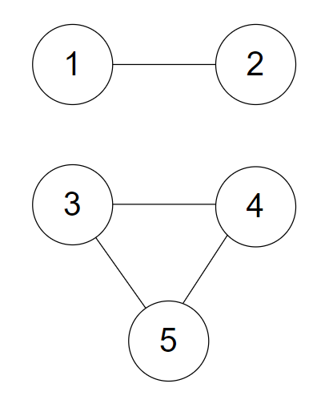

## 문제

[문제 링크](https://www.acmicpc.net/problem/1707)


### 이분그래프란?

이분그래프(Bipartite Graph)란, 인접한 노드를 서로 다른 색으로 칠해서 모든 노드를 두 가지 색으로만 칠할 수 있는 그래프이다.

즉, 그래프의 모든 노드들이 **두 그룹**으로 나눠지고, **같은 그룹에 속한 노드끼리는 서로 인접하지 않는 그래프**이다.

  


[이미지 출처] https://gmlwjd9405.github.io/2018/08/23/algorithm-bipartite-graph.html

<br>

`BFS 알고리즘`을 사용하면 같은 레벨의 노드를 모두 탐색한 후 다음 레벨의 노드 탐색을 시작하게 된다.

이분그래프라면 인접 노드는 서로 다른 그룹에 속해야 한다.  

따라서 **다음 레벨의 노드를 탐색할 때 현 노드와 다른 그룹으로 넣어주고, 만약 탐색하려는 다음 레벨의 노드가 이미 현 노드와 같은 그룹에 있다면 이분그래프가 아닌 것으로 판단**하면 되겠다고 생각했다.

처음에는 다음과 같이 코드를 짰다.

⚡ (참고로 서로 다른 두 그룹을 표현할 때 `1`, `-1` 이런식으로 표현해주면 편하다는 생각을 처음에 못해서 group1, group2 리스트를 두개 만들어서 넣었다 뺐다 했는데 이러면 시간초과 난다 ^^..  )

```python
import sys
from collections import deque

def bipartite(graph, group):     
    deq = deque([1]) 
    group[1] = 1  
    
    while deq:
        now = deq.popleft()        
        for next in graph[now]:            
            if group[next] == 0:  # 방문하지 않은 노드인 경우
                group[next] = -group[now]  # now와 다른 그룹으로 표시해줌
                deq.append(next)           
            else:  # 방문했던 노드인 경우
                if group[next] == group[now]:
                    return False  
            print(group)                  
    return True


K = int(input())
for _ in range(K):
    V, E = map(int, sys.stdin.readline().strip().split(" "))
    graph = [[] for _ in range(V+1)]
    group = [0]*(V+1)  # 방문 여부 및 그룹을 표시할 리스트 - 0으로 초기화

    for _ in range(E):
        u, v = map(int, sys.stdin.readline().strip().split(" "))
        graph[u].append(v)
        graph[v].append(u)
    
    result = bipartite(graph, group)
    print("YES" if result==True else "NO")
```


이러면 테스트케이스는 통과하는데 제출해보면 실패한다.

도저히 이유를 알 수가 없어서 구글링한 결과... 생각지도 못한 반례가 있었다. 바로 `연결되지 않은 그래프`이다.


### ✅ 반례

1

5 4

1 2

3 4

4 5

5 3



위 그림과 같은 연결되지 않은 그래프가 있을 때 정답은 NO 이지만, 코드를 실행해보면 1 2번 노드만 탐색하고 종료돼버리기 때문에 YES가 나온다.

**연결되지 않은 그래프가 여러개 있을 가능성을 두고, 반복문으로 모든 노드들을 탐색하여 아직 방문여부가 0으로 남아있는 노드가 있다면 함수를 또 실행해줘야 한다.**

<br>


## 최종 코드

```python
import sys
from collections import deque

def bipartite(graph, group, start):     
    deq = deque([start]) 
    group[start] = 1
    
    while deq:
        now = deq.popleft()        
        for next in graph[now]:             
            if group[next] == 0:
                group[next] = -group[now]
                deq.append(next)           
            else:
                if group[next] == group[now]:
                    return False                           
    return True


K = int(input())
for _ in range(K):
    V, E = map(int, sys.stdin.readline().strip().split(" "))
    graph = [[] for _ in range(V+1)]
    group = [0]*(V+1)

    for _ in range(E):
        u, v = map(int, sys.stdin.readline().strip().split(" "))
        graph[u].append(v)
        graph[v].append(u)
    
    # 모든 노드들을 탐색, 아직 방문여부가 0인 노드가 있다면 bipartite 함수 실행
    result = True
    for i in range(V): 
        if group[i] == 0:
            result = bipartite(graph, group, i)
            if result == False:
                break
    
    print("YES" if result else "NO")
```

