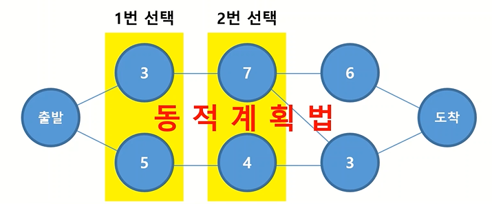
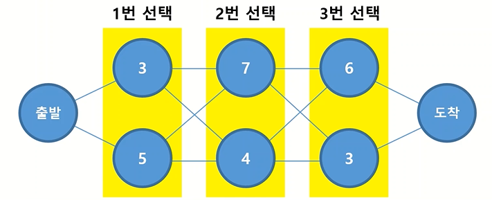
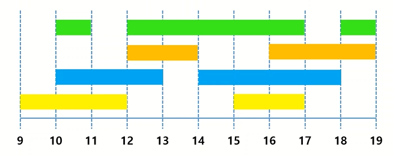

# 1. 탐욕법(Greedy Algorithm)?

전체가 아닌 **현재** 상태에서 최선의 선택을 하는 알고리즘.  

전체탐색보다 빠르지만 **반드시 정답을 도출하지는 않는다.**

전체 문제를 작은 문제로 나누어서 정답을 구한다는 점에서 동적계획법과 유사하지만, **작은 문제들의 최적의 해가  전체의 최적의 해가 될 수 있는지 판단해서 탐욕법이 적용가능한지 우선 판단해야 한다.**


## 1) 탐욕법을 쓸 수 있는 조건

1. `Greedy choice property` : 각 부분에서의 선택이 다른 부분에게 영향을 주지 않는다.

2. `Optimal substructure` : 각 부분에서의 최적해가 전체의 최적해이다.

      

⚡ 아래와 같은 최단경로탐색에서 1번 선택은 2번 선택에 영향을 준다 ➡ `동적계획법` 사용



⚡ 아래와 같은 최단경로탐색에서는 1번 선택과 상관없이 2번 선택을 할 수 있다 ➡ `탐욕법` 사용 가능




## 2) 탐욕법 예제

### ✅ 교환 가능한 동전의 최소 갯수 구하기

Q1 ) 500원, 100원, 50원, 10원을 사용해 1,970원 만들기

- 동전들이 서로간 배수이므로 탐욕법 적용 가능
- 매 순간의 최적의 해의 합이 전체의 최적의 해가 된다.

```python
coin = [500, 100, 50, 10]
n = 1970
cnt = 0

for c in coin:
    cnt += n // c  # 가장 큰 화폐단위부터 최대로 사용한다 (순간순간의 최적의 해를 구한다)
    n %= c  # n값을 c로 나누고 남은 나머지값으로 바꿔주고 반복문 진행 
    
print(cnt)  # 매 순간의 최적해의 합 = 정답
```


Q2 ) 500원, 300원, 200원, 50원, 10원을 사용해 1,970원 만들기

- 500원 3개 + 300원 1개 + 200원 0개 + 50원 3개 + 10원 2개 => **총 9개**

- 그러나 탐욕법을 따르지 않고 500원 3개 + 300원 0개 + 200원 2개 + 50원 1개 + 10원 2개를 사용한다면? => **총 8개**의 동전만 사용해도 된다

  - 300원이 200원의 배수가 아니기 때문에 **300원 선택의 순간이 200원 선택 순간에 영향을 미친다** => 탐욕법 적용 불가

    

### ✅ 가능한 많은 수의 회의시간

Q) 하나의 회의실을 여러 팀이 사용하고자 할때, 최대한 많은 팀이 회의실을 사용할 수 있도록 회의시간 배치하기



```python
meetings = [
    [9,12],
    [10,11],
    [10,13],
    [12,14],
    [12,17],
    [14,18],
    [15,17],
    [16,19],
    [18,19]
]

for 
```


### ✅ 카드게임

Q) 서로 한장씩 카드를 뽑아 비교했을 때 더 큰 숫자를 뽑은 사람이 점수를 획득한다. A가 얻을 수 있는 최대 점수는?

 