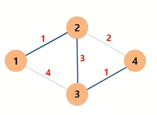
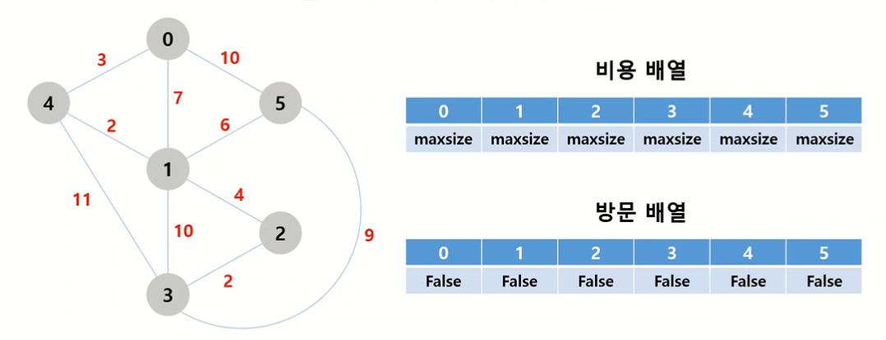
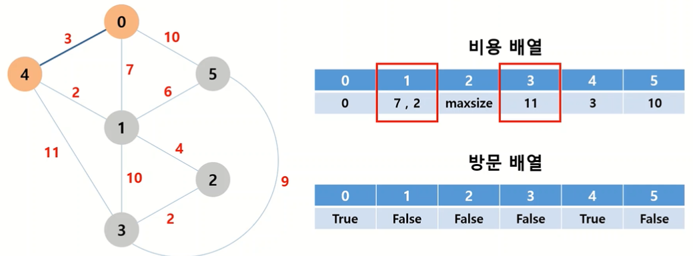
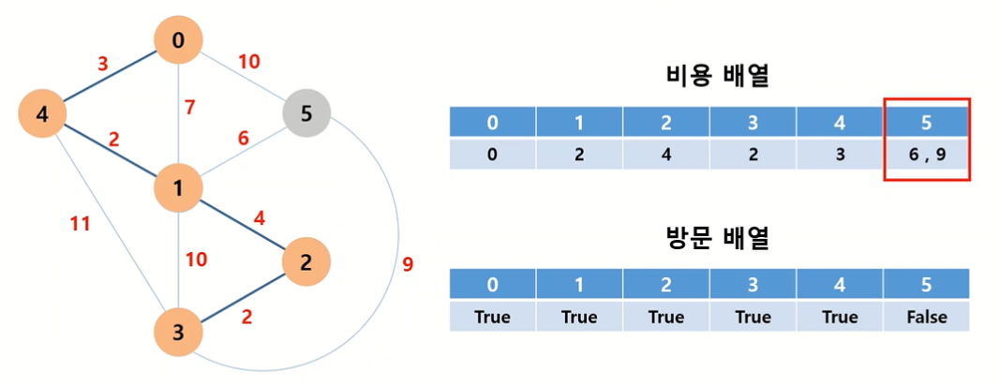
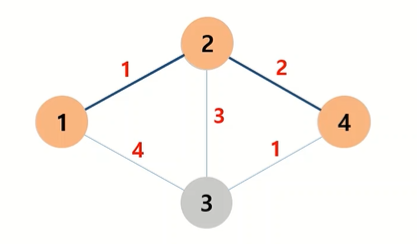
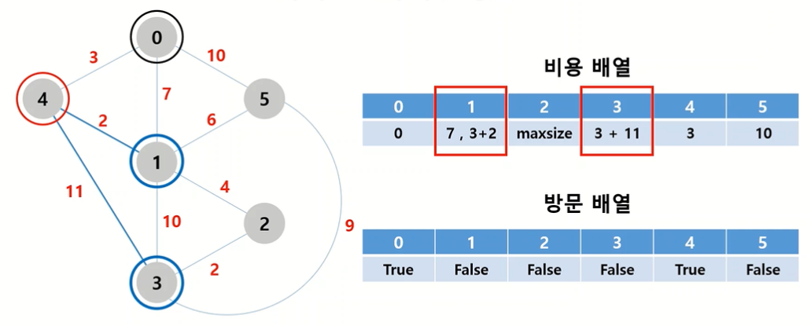

# 1. 최단 경로 찾기

## 1) 플로이드 와샬 알고리즘 

**존재하는 모든 노드를 최소 비용으로 하나로 연결**하는 최단 경로 찾기 알고리즘




### ✅ Q. 모든 노드를 연결할 수 있는 최소 비용은 얼마인가?



- `비용 배열`과 `방문 배열`을 선언한다. 비용 배열은 `int값이 가질 수 있는 최대값`을, 방문 배열에는 아직 방문하지 않았음을 의미하는 `False`를 담아둔다.
- 아무 노드에서나 시작해도 상관없다. 편의상 0번 노드에서 탐색을 시작한다.
- 비용배열의 0번째 인덱스 값을 0번 노드에서 0번 노드까지의 거리인 `0`으로, 방문배열의 0번째 인덱스 값을 `True`로 갱신한다.
- 0번 노드에서 연결할 수 있는 노드는 1, 4, 5번 노드이다.  비용배열의 1, 4, 5번 인덱스 값을 기존값(maxsize)과 비교하여 더 작은 값인 `7`, `3`, `10`으로 각각 갱신한다.
- 4번 노드까지의 거리가 최소값이므로 4번으로 이동한다. 방문배열의 4번째 인덱스값을 `True`로 갱신한다.
- 4번 노드에서 아직 방문하지 않았으면서 연결할 수 있는 노드는 1, 3번 노드이다.  비용배열의 1, 3번째 인덱스값을 기존값(7, maxsize)와 비교하여 더 작은 값인 `2`, `11`로 각각 갱신한다.



- ... 반복 ...
- 3번 노드에서 5번 노드까지 갈 수 있으나, 그 비용인 `9`가 기존값(6)보다 작으므로 갱신되지 않는다.  



- 마지막 남은 노드인 5번까지 최소 비용으로 연결하고 작업을 종료한다.
- 모든 노드를 연결하는 최소 비용은 0+2+4+2+3+6 = 17 이다.


```python
n = 6  # 노드의 총 개수
costs = [  # [노드a, 노드b, a에서 b로 이동하는 비용]
    [0,1,7],
    [0,4,3],
    [0,5,10],
    [1,2,4],
    [1,3,10],
    [1,4,2],
    [1,5,6],
    [2,3,2],
    [3,4,11],
    [3,5,9]    
]

def solution(costs):
    values = [2**31-1 for _ in range(n)]  # 비용 배열 : int의 최대값으로 초기 설정
    visited = [False for _ in range(n)]  # 방문 배열 : False로 초기 설정
    answer = 0

    start = 0  # 0번 노드에서 시작
    visited[start] = True
    values[start] = 0
    
    while False in visited:
        # 노드 완전탐색으로 비용배열의 값을 최소값으로 갱신
        for i in costs:
            if visited[i[1]] == False and i[0] == start:   # i[0]에서 i[1]로 가는 경우
                values[i[1]] = min(values[i[1]], i[2])
            if visited[i[0]] == False and i[1] == start:   # i[1]에서 i[0]로 가는 경우
                values[i[0]] = min(values[i[0]], i[2])

        # 방문하지 않은 노드 중 최소 비용으로 갈 수 있는 노드 탐색
        refer = 2**31-1        
        for i in range(n):
            if visited[i] == False and values[i] != 0:
                refer = min(refer, values[i])
        answer += refer
        
        # 해당 노드 방문 체크
        for i in range(n):
            if visited[i] == False and values[i] == refer:
                visited[i] = True
                start = i  # 현재 노드를 i로 이동한 후 while문 재실행
                break            

	return answer
```


## 2) 다익스트라 알고리즘 

**특정 노드에서 다른 노드까지의 최단 경로**를 찾는 알고리즘

>  💡 **동작 원리**
>
> 1. 출발 노드를 설정한다
> 2. 비용 리스트를 (무한으로) 초기화한다
> 3. 방문하지 않은 노드 중 최단 거리가 가장 짧은 노드를 선택한다
> 4. 해당 노드를 거쳐 다음 노드로 가는 비용을 계산한다. 다음 노드로 가는 비용을 기존에 구해놓은 값이 있다면, 새로 구한 값과 기존값중 최소값으로 비용 리스트를 갱신한다
> 5. 3~4번 과정을 반복한다


예: 1번 노드에서 4번 노드까지의 최단경로 찾기




### ✅  Q. 0번 노드에서 n번 노드까지 연결하는 최소 비용은 얼마인가?


- `비용 배열`과 `방문 배열`을 선언한다. 비용 배열은 `int값이 가질 수 있는 최대값`을, 방문 배열에는 아직 방문하지 않았음을 의미하는 `False`를 담아둔다.
- 비용배열의 0번째 인덱스 값을 0번 노드에서 0번 노드까지의 거리인 `0`으로, 방문배열의 0번째 인덱스 값을 `True`로 갱신한다.
- 0번 노드에서 연결할 수 있는 노드는 1, 4, 5번 노드이다.  비용배열의 1, 4, 5번 인덱스 값을 기존값(maxsize)과 비교하여 더 작은 값인 `7`, `3`, `10`으로 각각 갱신한다.
- **4번 노드까지의 거리가 최소값**이므로, 방문배열의 4번째 인덱스값을 `True`로 갱신한다.

- 4번 노드에서 아직 방문하지 않았으면서 연결할 수 있는 노드는 1, 3번 노드이다. 그런데 1번 노드까지 가는 길은 0번에서 4번을 거쳐서 1번으로 가는 방법도 있지만(비용 3+2 = 5), 아까 계산해놓은 0번에서 1번으로 바로 가는 방법도 있다(비용 7).  **⚡즉, 다익스트라 알고리즘에서는 현재 노드까지 오는 비용에 새로운 노드로 가는 비용을 누적하고, 그 누적값을 기존값과 비교하여 최소값으로 갱신한다.** ⚡  따라서 1번 노드로 가는 비용은 3+2=5와 기존값(7) 중 최솟값인 `5`로 갱신한다. 3번으로 가는 비용은 3+11 = 14와 기존값(maxsize) 중 최솟값인 `14`로 갱신한다.  비용 갱신을 마친 후 탐색을 종료한다.

  



- **아직 방문하지 않은 1, 2, 3, 5번 노드 중에서 비용 최소값을 갖는** 1번 노드에서 탐색을 시작한다.  1번 노드를 방문했음을 표시하기 위해 방문배열의 1번인덱스 값을 `True`로 변경한다.
- 1번 노드에서 아직 방문하지 않았으면서 연결할 수 있는 노드는 2, 3, 5번이다.  1번 노드까지 오는 비용(5)에 새로 연결될 노드까지 가는 비용 4, 10, 6을 더한 9, 15, 11을 기존 비용(maxsize, 14, 10)과 비교하여, 둘 중 최소값인 `9`, `14`, `10`으로 각각 갱신한다. 비용 갱신을 마친 후 탐색을 종료한다.
- ... 반복 ...
- 마지막으로 방문하지 않은 3번 노드에서 탐색을 시작한다. 아직 방문하지 않았으면서 연결할 수 있는 노드가 더이상 없으므로 알고리즘을 종료한다.

- 최종적으로 비용배열 values의 원소 values[i]는 0번 노드에서 i번 노드로 가는 최소 비용이 된다. 

```python
import sys

n = 6
costs = [
    [0,1,7],
    [0,4,3],
    [0,5,10],
    [1,2,4],
    [1,3,10],
    [1,4,2],
    [1,5,6],
    [2,3,2],
    [3,4,11],
    [3,5,9]    
]

def solution(costs):
    values = [sys.maxsize for _ in range(n)]  # 비용 배열 : int의 최대값으로 초기 설정
    visited = [False for _ in range(n)]  # 방문 배열 : False로 초기 설정
    
    start = 0  # 시작 노드
    values[start] = 0   
    
    while False in visited:
        # 탐색하지 않은 노드 찾기
        checkLoc = -1  # 탐색할 노드를 담을 변수
        checkValue = sys.maxsize  # 해당 노드까지 가는 비용을 담을 변수
        for i in range(n):
            if visited[i] == False and values[i] < checkValue:  # for문을 돌면서 방문하지 않은 노드 중 비용 최솟값을 갖는 노드를 선택
                checkLoc = i  
                checkValue = values[i]  
                       
        # 탐색하지 않은 노드가 없다면(for문 다 돌았는데 checkLoc가 바뀌지 않음) while문 종료
        if checkLoc == -1:
            break       
        
        # 경로 완전탐색으로 비용배열 갱신
        visited[checkLoc] = True
        for v1, v2, c in costs:
            if v1 == checkLoc and visited[v2] == False:   # v1에서 v2로 가는 경우
                values[v2] = min(values[v2], values[v1]+c)
            if v2 == checkLoc and visited[v1] == False:   # v2에서 v1로 가는 경우
                values[v1] = min(values[v1], values[v2]+c)
        
    return values   
    
```


