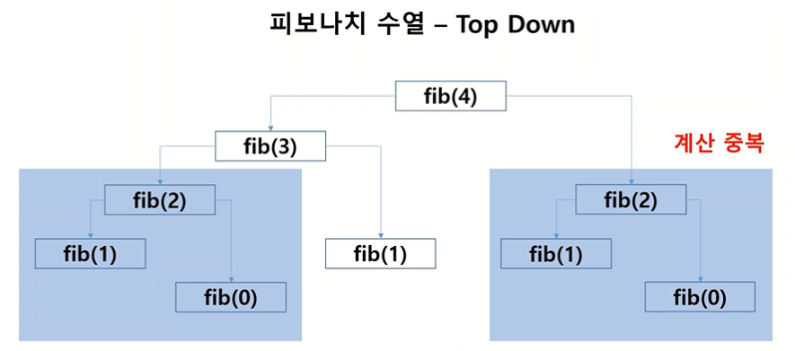

# 1. 동적계획법이란?

- Dynamic Programming (DP)
- 하나의 큰 문제를 여러 개의 공통되는 작은 문제로 나누어서 작은 문제의 정답들을 결합하여 알고리즘을 푸는 과정
- `규칙을 찾는 문제` 라고 생각하면 됨
  - ⚡**점화식(수열에서 n번째 항을 이전에 나온 항들로 나타낸 공식)** 을 생각해보자


## 1) 동적계획법 접근방법

### (1) Bottom Up

작은 문제에서 큰 문제로 `반복문` 호출

  	  

✅ **피보나치 수열** 반복문 사용하여 구하기

점화식 👇


```python
def fibonaci(n):
    fibList = [1, 1]
    for i in range(2, n+1):
        fibList.append(fibList[i-2] + fibList[i-1])
    
    return fibList[-1]
```


### (2) Top Down

큰 문제에서 작은 문제로 `재귀함수` 호출

  	  

✅  **피보나치 수열** 재귀함수 사용하여 구하기

- n번째 값을 구하기 위해서 n-1번째와 n-2번째 값 호출
- ... 반복 ...
- 최종적으로 1번째와 0번째 값을 호출하게 되는데, 이 값은 더이상 나눠지지 않고 그냥 1을 반환하면서 재귀함수 종료


```python
def fibonaci(n):
    if n == 0 or n == 1:
        return 1
    else:
        return fibonaci(n-1) + fibonaci(n-2)
```


## 2) 메모이제이션(Memoization)

Top Down으로 재귀함수 구현시 중복 계산 발생




 **메모이제이션** 기술 활용

- 앞에서 했던 계산을 저장해두고 필요한 경우 불러와서 활용 - 중복 계산 방지
- `배열(List)` 혹은 `해시(Dictionary)`를 활용하는 것이 핵심

```python
memo = {0:1, 1:1}  # 계산값을 저장해놓을 딕셔너리(혹은 리스트) 선언

def fibonaci(n):
    # 딕셔너리에 값이 저장돼있다면 재귀함수 실행하지 않고 저장된 값을 불러온다
    if n in memo:
        return memo[n]
    # 그렇지 않다면 재귀함수 실행
    else:
        result = fibonaci(n-1) + fibonaci(n-2)
        memo[n] = result  # 찾은 값은 딕셔너리에 저장
        return result
```


## 3) 동적계획법 문제 예시

✅ data = [3, 4, 5, 6, 1, 2, 5] 가 주어질때,  이웃하지 않는 숫자들의 합의 최댓값은?

(예를 들어, 3을 선택했다면 이웃한 4는 선택할 수 없고 5부터 선택할 수 있다)

점화식 👇


```python
def solution(data):
    # 입력된 배열 data의 길이가 1이라면 data의 첫번째 원소를 반환하고 종료
    if len(data) == 1:
        return data[0]
    
    # 메모이제이션을 위한 배열 선언
    result = [data[0], max(data[0], data[1])]  # a1과 S2 값 저장해놓음
    
    # bottom-up 방식으로 배열에 값 담아나가기
    for i in range(2, len(data)):
        result.append(max(result[i-1], result[i-2]+data[i]))
    
    return result[-1]
```


