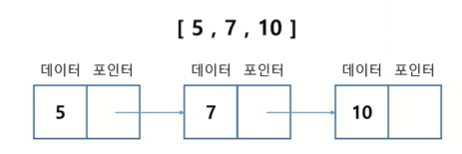
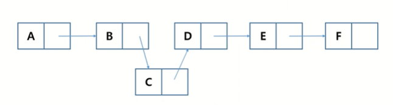
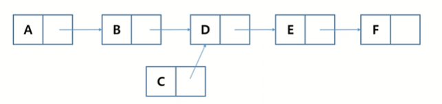
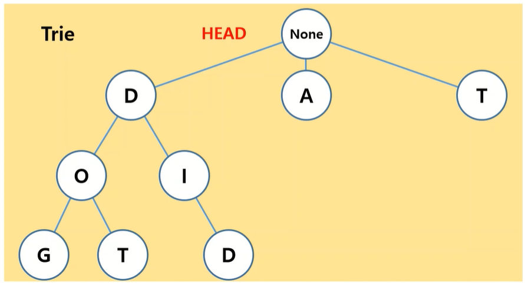
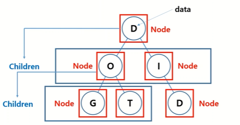

---

title: '[Algorithm] 연결리스트와 트라이구조'
date: 2021-10-22 13:08:79
category: 'Algorithm'
thumbnail: { thumbnailSrc }
draft: false
---


## 연결리스트 (LinkedList)

각 노드가  데이터와 포인터를 가지고 한 줄로 연결되어 데이터를 저장하는 자료 구조



<br>

### 리스트 vs 연결리스트

- 리스트

  - 데이터를 인덱스 값에 따라 저장

  - 원소를 중간에 하나 삽입하거나 삭제하면, 그 뒤의 원소들이 하나씩 뒤로 밀리거나 앞당겨지면서 인덱스가 다 변화하게 된다
  - 대량의 데이터에서 삽입 / 삭제 시 성능이 저하된다

- 연결리스트

  - 데이터를 **앞 뒤 데이터에 따라** 저장
  - 원소 b와 d 사이에 c라는 원소를 추가한다고 가정했을 때, **b와 d 사이의 연결을 끊고 c와 두 번의 연결을 해주면 된다**

  

  - 원소 c를 삭제한다고 가정했을 때, **b에서 c로의 연결을 끊고 b에서 d로 연결을 해주면 된다**

    


<br>

### 연결리스트 구현

>  ⚡ **연결리스트의 구성**
>
> - 노드
>     - data  : 실제 데이터 부분
>     - next : 다음 노드를 가리키는 부분
> - head : 가장 앞에 있는 노드


```python
class Node():
    def __init__(self, data):
        self.data = data
        self.next = None
 

class LinkedList():
    def __init__(self):
        self.head = None
        self.count = 0   # 알고리즘의 목적에 맞게 이렇게 필요한 변수를 선언해 주면 된다 (여기서 count는 연결리스트의 길이를 나타내는 변수임)
        
        
    # 1) 헤드 추가하는 함수
    def appendHead(self, node):
        # 기존에 데이터가 없었다면
        if self.head == None:            
            self.head = node  
            self.count = 1
        # 기존에 데이터가 있었다면
        else:             
            currentHead = self.head
            self.head = node
            node.next = currentHead  # 새로 추가된 헤드 다음에 기존 헤드가 연결되도록 함
            self.count += 1
            
            
    # 2) 연결리스트의 가장 마지막에 노드를 추가하는 함수
    def append(self, node):
        # 기존에 데이터가 없었다면
        if self.head == None:
            self.head = node
            self.count = 1
        # 기존에 데이터가 있었다면
        else:
            now = self.head
            while now.next != None:  # 반복문을 통해 연결리스트의 맨 끝에 도달
                now = now.next  # now 변수에 가장 맨 마지막 데이터를 담음
            now.next = node  # 마지막 데이터 다음에 새로 들어온 노드를 연결
            self.count += 1
            
	
    # 3) 특정 위치에 노드를 추가하는 함수
    def insertNodeAtIndex(self, node, index):
        # 인덱스가 0보다 작거나 연결리스트 길이보다 크다면 무효
        if index < 0 or index > self.count:
            return -1
        # 인덱스가 연결리스트 길이와 같다면 맨 마지막에 노드를 추가하는 것임
        elif index == self.count:
            self.append(node)
        # 인덱스가 0인 경우 맨 앞에 노드를 추가하는 것임
        elif index == 0:
            self.appendHead(node)
        # 인덱스가 연결리스트 중간이라면   
        else:
            now = self.head
            while index > 0: 
                index -= 1  # 반복문을 통해 삽입하고자 하는 인덱스까지 움직임
                now = now.next  # 반복문이 끝나면 now 변수에 삽입하고자 하는 위치의 노드가 담김             
            next = now.next  # 원래 now 뒤에 있던 노드
            now.next = node  # now의 뒤에 새로 추가할 노드를 연결
            node.next = next  # 새로 추가된 노드 뒤에 원래 now 뒤에 있던 노드를 연결
            self.count += 1
            
     
    # 4) 노드 삭제
    def deleteData(self, data):
        # 삭제하고자 하는 노드가 헤드라면
        if self.head.data == data:
            self.head = self.head.next  # 헤드 다음 노드를 헤드로 만들어주면 끝
            self.count -= 1
        # 삭제하고자 하는 노드가 헤드가 아니라면
        else:
            first = self.head  
            second = first.next
            while second != None:  # 반복문을 통해 연결리스트의 끝까지 탐색
                if second.data == data:  # 만약 second가 삭제하고자 하는 노드라면
                    first.next = second.next  # first의 다음 노드로 second의 다음 노드를 연결해주면 자동으로 second 노드가 삭제됨
                	self.cound -= 1
                    break  
                first = second  # if 블록에 걸리지 않았다면 한칸 뒤로 옮겨서 탐색 계속
                
                
    # 5) 노드의 개수 구하기
    def getCount(self):
        return self.count        
                
                 
      
```


<br>

## 트라이(Trie) 구조 

문자열을 효율적으로 저장하고 탐색하기 위한 트리 형태의 자료구조


<br>

### 트라이 구조 구현

> 💡 **트라이 구조의 구성**
>
> - 노드
>   - 데이터
>   - 자식노드들을 나타내는 부분
> - 헤드 :  최상단 노드 (None 또는 Null값)







```python
class Node():
    def __init__(self, data):
        self.data = data
        self.children = {}  # 해당 노드의 자식 노드들을 나타낼 리스트 혹은 딕셔너리
        
        
class Trie():
    def __init__(self, data):
        self.head = Node(None)  # 트라이구조의 헤드는 데이터로 None값을 가짐
        
    # 트라이구조에 데이터 삽입하는 함수
    def insert(self, string):
        head = self.head
        for s in string:  # 삽입하고자 하는 문자열을 반복문으로 한글자씩 탐색
        	children = head.children 
            if s not in children:  
                children[s] = Node(s)  # children 딕셔너리에 해당 글자를 데이터로 가지는 노드 삽입
            head = children[s]  # 삽입한 글자를 다시 head로 만들어서 다음 글자에 대해서 작업 계속       
    
```


<br>

### 트라이 구조의 사용 예시

✅ 추천검색어

:  한 글자씩 입력할 때마다 해당 글자 다음에 어떤 글자가 가장 많이 검색되었는지에 대한 데이터를 가지고 있기 때문에 다음 글자를 추천해줄 수 있음
