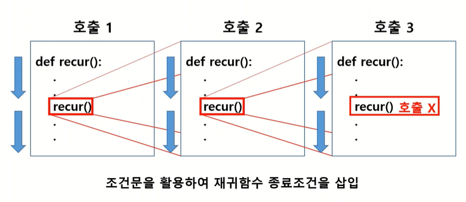

## 재귀함수

메소드 혹은 함수의 내부에서 자기 자신의 메소드 혹은 함수를 다시 호출하는 함수


### 재귀함수 작동 원리



- recur 함수가 호출된다
- 중간에 recur 함수 호출하는 부분을 만나면 두번째로 recur 함수를 호출한다.
- 중간에 recur 함수 호출하는 부분을 만나면 세번째로 recur 함수를 호출한다.
- 재귀함수 종료조건에 의해 recur 함수가 종료된다.
  - ⚡ 재귀함수 사용시에는 **조건문을 활용하여 반드시 재귀함수 종료조건을 삽입**해야 한다
- 두번째 호출에서 recur() 호출 부분이 종료되었으므로 아랫줄을 마저 실행하고 두번째 recur 함수를 종료한다.
- 첫번째 호출에서 recur() 호출 부분이 종료되었으므로 아랫줄을 마저 실행하고 첫번째 recur 함수를 종료한다.


<br>

## 재귀함수 사용 예시

### (1) n개 성분들의 합으로 표현할 수 있는 모든 숫자 구하기

- 모든 경우의 수는 `2^n개`이다  (각 원소가 선택되느냐/선택 안되느냐)

- 중복된 값이 있을수도 있으니 `set`에 담아 중복 제거해준다

✅ 반복문 사용

```python
data = [3, 5, 8]
    
result = set()

for i in range(2): # i=0 : 첫번째 원소 선택안함 / i=1 : 선택함
	for j in range(2): # j=0 : 두번째 원소 선택안함 / j=1 : 선택함
		for k in range(2): # k=0 : 세번째 원소 선택안함 / k=1 : 선택함
			result.add(data[0]*i + data[1]*j + data[2]*k)
```

만약 원소 개수가 7개라면? 반복문 7개 있어야 한다... 매우 비효율적


✅ **재귀함수 사용**

```python
data = [3, 5, 8]
index = 0
value = 0
result = set() 

def recur(index, value):   
    # 재귀함수 종료 구문
    if index == len(data):
        result.add(value)
    
    # 재귀함수 본문   
    else:
        recur(index + 1, value + data[index]) # 원소 선택하고 다음 원소로
        recur(index + 1, value) # 원소 선택 안하고 다음 원소로

    return result

print(recur(index, value)) # {0, 3, 5, 8, 11, 13, 16}

```


### (2) 팩토리얼 구하기

```python
def factorial(n):
    if n == 1:
        return 1
    else:
        return n * factorial(n-1)
    
print(factorial(5))  # 120
```


### (3) 피보나치 수열

```python
def fibonacci(n):
    if n == 0 or n == 1:
        return 1
    else:
        return fibonacci(n-1) + fibonacci(n-2)
```


