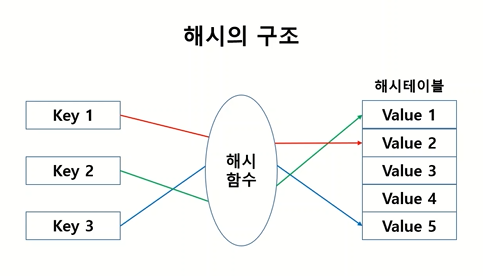

## 해시

key와 value 쌍으로 데이터를 저장하는 구조

검색과 저장이 매우 유용한 구조이다.


## 해시의 구조

- `key`
- `해시함수` 
  - 임의의 길이를 갖는 메시지를 입력받아 고정된 길이의 해시값을 출력하는 함수
  - 해시함수에 의하여 key값이 숫자(해시값)로 변환된다
- `해시테이블`
  - 해시값을 인덱스로 사용하는 배열




## 해시 구현

파이썬 `딕셔너리` 클래스 활용

- 삽입

```python
hash = dict()

hash[1] = 'apple'  
hash['banana'] = 3  # 문자열을 key값으로 사용 가능
hash[(4,5)] = [1,2,3]  # 튜플을 key값으로 사용 가능
hash[10] = dict({1:'a', 2:'b'})  # value값에 또다른 딕셔너리 저장 가능

# hash[[1,2,3]] = 5  # 리스트는 key값으로 사용 불가
# hash[{1,2}] = 6  # 집합은 key값으로 사용 불가


```


- 수정

```python
hash[1] = 'melon'
hash['banana'] = 10
```


- 추출

```python
hash.pop(1)   # 'melon'
hash.pop((4,5))  # [1,2,3]
```


- 삭제

```python
del hash['banana']
```


## 딕셔너리 활용

### (1) 딕셔너리 루프

```python
hash = dict()
for i in range(1,6):
    hash[i] = i**2
    
    
# keys() 함수 : key값을 추출
for k in hash.keys():
    print(k)  
    
# values() 함수 : value값을 추출 
for v in hash.values():
    print(v)  

# items() 함수 : key와 value를 튜플 형태로 반환
for k, v in hash.items():
    print(k, v)   
    

```

<br>

### (2) 딕셔너리 정렬

`sorted()` 함수 사용

- 주의: sorted() 함수는 무조건 `list` 형태를 반환한다

```python
hash = dict({1:10, 3:12, 5:7, 7:6, 4:5})


# key값을 기준으로 오름차순 정렬
sorted(hash.keys(), key=lambda x:x)  # [1,3,4,5,7]

# value값을 기준으로 오름차순 정렬
sorted(hash.values(), key=lambda x:x)  # [5,6,7,10,12]

# key와 value를 기준으로 오름차순 정렬
sorted(hash.items(), key=lambda x:x)  #[(1,10), (3,12), (4,5), (5,7), (7,6)]  : 튜플의 첫번째 원소(key값)에 의한 오름차순 정렬됨

# key값을 기준으로 내림차순 정렬
sorted(hash.keys(), key=lambda x:-x)  # [7,5,4,3,1]

# key와 value를 기준으로 내림차순 정렬
sorted(hash.items(), key=lambda x:-x[1])  #[(3,12), (1,10), (5,7), (7,6), (4,5)] : 튜플의 [1]번 인덱스 값인 value값에 의한 내림차순 정렬됨


```

