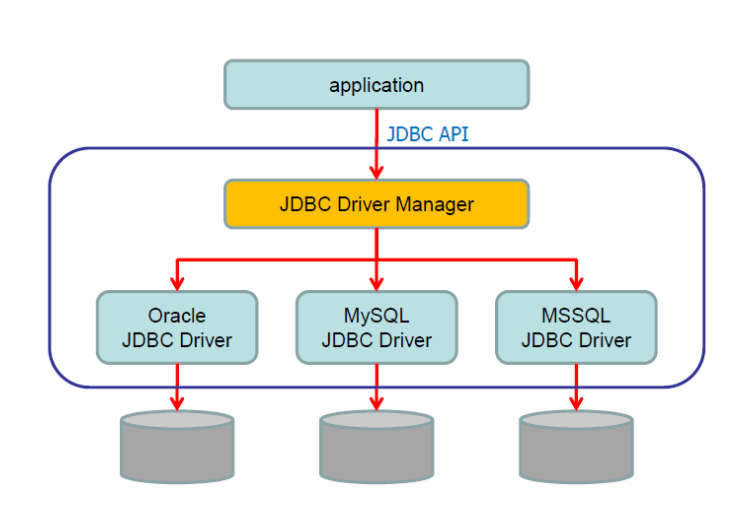
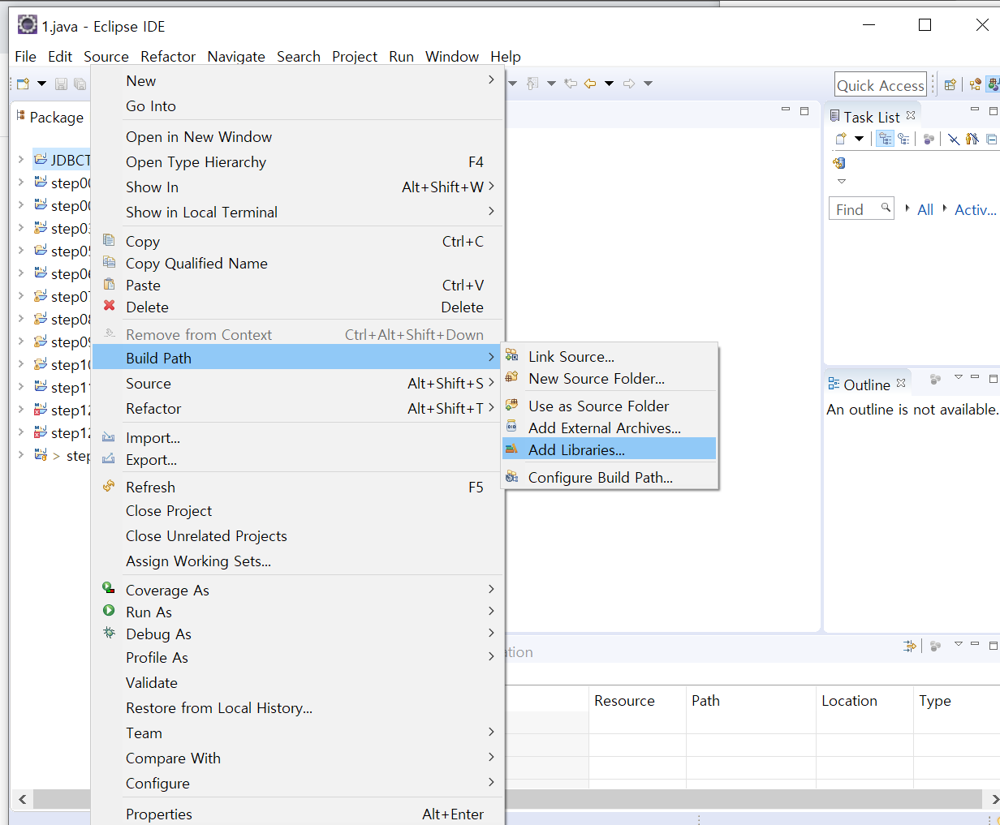
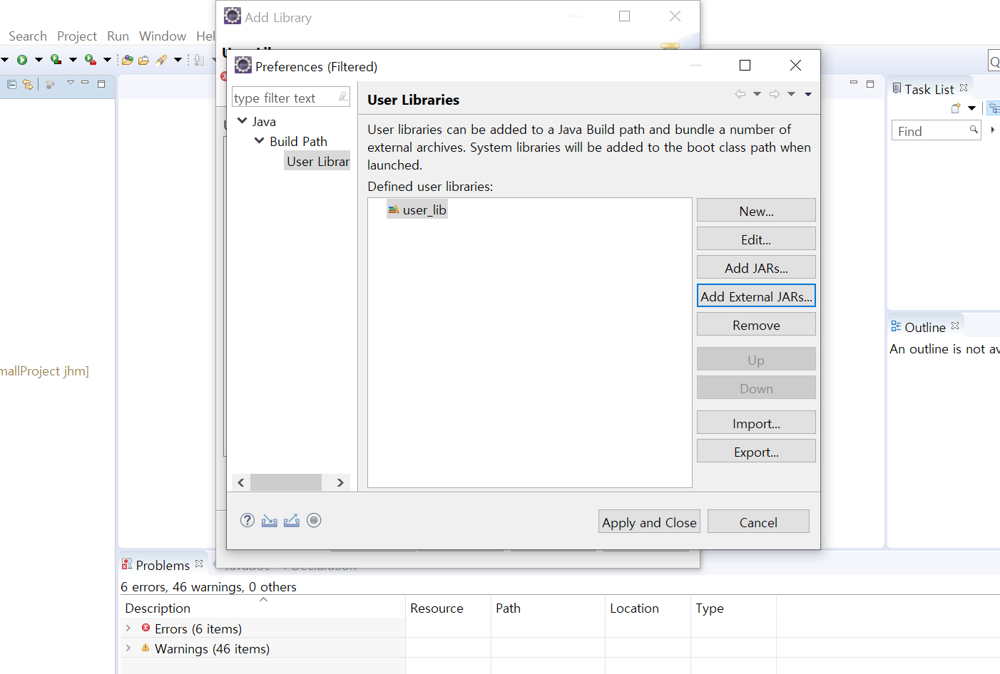
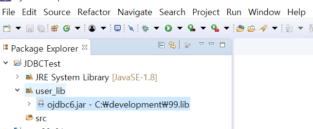

##  JDBC

**Java DataBase Connectivity**

자바 언어로 다양한 종류의 DB에 접속하고 SQL문을 수행하기 위해 사용되는 표준 API. 

자바 프로그램과 DBMS간의 통신을 중간에서 번역해주는 역할을 한다고 보면 된다.



[이미지 출처] https://m.blog.naver.com/PostView.naver?isHttpsRedirect=true&blogId=jsky10503&logNo=221179911080


## JDBC 인터페이스

JDBC 프로그램을 만들기 위한 API들. java.sql 패키지 내에 있는 주요 API들은 다음과 같다.

- `java.sql.Driver`
  - DB 벤더에 맞는 드라이버를 호출하는 인터페이스

- `java.sql.Connection`
  - 특정 DB와의 연결 정보를 가지는 인터페이스
  - DriverManager로부터 Connection 객체를 가져온다
- `java.sql.Statement`
  - SQL 쿼리문을 DB에 전송하는 방법을 정의한 인터페이스
- `java.sql.PreparedStatement`
  - Statement의 하위 인터페이스
  - SQL문을 미리 컴파일하여 실행 속도를 높임
- `java.sql.ResultSet`
  - SELECT 구문 실행 결과를 조회할 수 있는 방법을 정의한 인터페이스


##  JDBC Driver

:  자바 프로그램의 요청을 각 DBMS가 이해할 수 있게 해주는 자바 클래스 파일

- java.sql의 인터페이스들은 표준화를 위한 틀 역할만 제공하고,  **JDBC Driver가 인터페이스를 상속하여 재정의**함으로써  실제 메소드 몸체를 구현한다.

- 각 DB 벤더사가 JDBC Driver를 제공하기 때문에 개발자는 직접 인터페이스를 재정의할 필요 없이 가져다 쓰기만 하면 된다.

  > 오라클: oracle.jdbc.driver.OracleDriver
  >
  > MySQL: com.mysql.jdbc.Driver 
  >
  > MariaDB: org.mariadb.jdbc.Driver  등등

<br>

### 이클립스에서 JDBC 드라이버 사용하기 - Oracle11g XE 기준

1. 오라클이 설치되어 있다면 오라클 드라이버 jar파일(=자바 실행파일)도 이미 가지고 있다. 오라클이 설치된 디렉토리로 가서 `oraclexe\app\oracle\product\11.2.0\server\jdbc\lib` 경로로 찾아가보면 **odbc6.jar** 파일이 있다(jdk1.8 이상에서 사용). 이 파일을 원하는 위치에 복사해둔다.

2. 자바 프로젝트를 우클릭하여 Build Path - Add Libraries 통해 라이브러리를 추가한다.

   목록 중 User Library를 선택한다.




3. New를 눌러 새로운 라이브러리를 추가한 뒤, **Add External JARs**를 누르고 아까 복사해뒀던 **odbc6.jar**를 추가한다.  Apply and Close를 눌러 등록 완료한다.




4. 패키지 하단에 이렇게 odbc6.jar가 정상 등록되어 있다면 이제 이클립스에서 oracle JDBC Driver를 사용할 수 있다.




## JDBC 프로그래밍 

JDBC를 이용한 프로그램은 다음과 같은 흐름으로 구성된다.

1. 특정 DB에 접속하는 객체 생성

   ```java
   Connection con = DriverManager.getConnection
       			 ("jdbc:oracle:thin:@127.0.0.1:1521:xe", "SCOTT", "TIGER");
   ```

   ✨ getConnection 메소드의 인자값
   - String url : 접속할 서버의 URL이다. 프로토콜 (jdbc:) , 서버주소(127.0.0.1 = 로컬서버라는 뜻), 서버 포트(1521), DB이름(xe)으로 구성된다. 
   - String user : DB 로그인 계정
   - String password : DB 로그인 비밀번호

   ⚡ DB접속 관련 정보가 코드에 노출되지 않도록 properties파일에 따로 저장하여 사용 권장

   ```java
   private static Properties dbinfo = new Properties();
   	
   	// static 블록을 사용해 프로그램 실행시 딱 한번만 로딩해서 메모리에 저장
   	static {
   		try {
   			dbinfo.load(new FileInputStream("dbinfo.properties"));
   		} catch (IOException e) {
   			e.printStackTrace();
   		}
   	}
   	
   	public static Connection getConnection() throws SQLException {  
   		return DriverManager.getConnection(dbinfo.getProperty("jdbc.url"), 	
                                          dbinfo.getProperty("jdbc.id"), 
                                          dbinfo.getProperty("jdbc.pw"));	
   	}
   ```

   <dbinfo.properties 파일>

   ```properties
   #db.properties
   jdbc.driver=oracle.jdbc.driver.OracleDriver
   jdbc.url=jdbc:oracle:thin:@127.0.0.1:1521:xe
   jdbc.id=SCOTT
   jdbc.pw=TIGER
   ```

   

2. SQL 문장 실행 가능한 객체 생성

   ```java
   Statement stmt = con.createStatement();
   ```

   

3. SQL 문장 실행

   ```java
   // dept테이블의 모든 데이터를 조회하는 select문 실행
   ResultSet rset = stmt.executeQuery("select * from dept")
   ```

   ✨ SQL문을 실행하기 위해 Statement 객체에서 제공하는 메소드

   - `executeQuery` : select문 실행하여 ResultSet 객체 반환

   - `ResultSet` : select한 데이터집합을 가지는 객체

   - `executeUpdate` : insert, update, delete문 실행

     ​		 

   

4. 결과 활용

   ```java
   // select한 결과 출력
   while(rset.next()) {
   	System.out.println(rset.getInt("deptno") + "/" + rset.getString("dname") + "/" 
                          + rset.getString("loc"));
   }
   ```

   현재 resultSet 객체 rset이 가지고 있는 값은 다음과 같다.

   | 커서 | deptno | dname | loc  |           |
   | ---- | ------ | ----- | ---- | --------- |
   | `→`  |        |       |      | 시작 빈행 |
   |      | 10     | a     | aa   |           |
   |      | 20     | b     | bb   |           |
   |      |        |       |      | 끝 빈행   |

   

   ✨ ResultSet 객체의 메소드

   - `next()  ` : 커서 다음에 레코드가 있는지 판단하여 없으면 false, 있으면 true를 반환한 다음에 커서를 다음 레코드로 이동시킴

   - `getInt()` / `getString()`  :  현재 커서가 가리키는 레코드의 컬럼 값을 데이터 타입에 따라 추출. 파라미터로 컬럼 인덱스 또는 컬럼명 사용 가능. 

     <br>

5. 자원 반환

   ```java
   // 반환 순서 - 가장 최근에 사용한 객체부터
   rset.close()
   stmt.close()
   con.close()
   ```

   

<br>

## DAO Pattern

**Data Access Object** Pattern

- DB 연동 클래스를 정형화해서 개발하게 하는 구조
- 일반적으로 한 테이블 당 하나의 DAO 클래스를 개발함
- 각 DAO 클래스는 CRUD 기능을 실행해주는 메소드 제공

<br>

### DAO에서 Connection에 접근하는 방식

❓ DAO 클래스 내 메소드에서 직접 Connection 생성한다면?

- 메소드를 실행할 때마다 매번 커넥션 생성 및 자원반환 코드를 작성한다 

- 중복 코드로 비효율적임


이를 해결하기 위해,  Connection 생성 및 자원반환만 담당하는 `Util 클래스 따로 개발`하고 DAO 클래스 내 메소드에서 가져다 쓰는 것이 효율적이다.

<br>

⚡ Util 클래스 개발 예 : 

```java
package util;

import java.sql.Connection;
import java.sql.DriverManager;
import java.sql.ResultSet;
import java.sql.SQLException;
import java.sql.Statement;

public class DBUtil {   
    // 주의 : DB접속 정보에 관한 에러는 사용자가 알아야 하는 정보
    // 메소드를 실행한 위치로 throws SQLException
    public static Connection getConnection() throws SQLException {
        return DriverManager.getConnection(
            	"jdbc:oracle:thin:@127.0.0.1:1521:xe", "SCOTT", "TIGER");
    }
    
    public static void close(Connection con, Statement stmt, ResultSet rset) {
        try {
            if(rset != null) {
                rset.close();
                rset = null;
            }
            if(stmt != null) {
                stmt.close();
                stmt = null;
            }
            if(con != null) {
                con.close();
                con = null;
            }
        }catch (SQLException e) {
            e.printStackTrace();	
         // 자원 반환에 관련된 에러에 관한 내용은 사용자가 알 필요 없음
         // 현 위치에서 catch
        }
    }    
	
    // select용 자원반환 메서드
    public static void close(Connection con, Statement stmt, ResultSet rset) {
        try {
            if(rset != null) {
                rset.close();
                rset = null;
            }
            if(stmt != null) {
                stmt.close();
                stmt = null;
            }
            if(con != null) {
                con.close();
                con = null;
            }
        }catch (SQLException e) {
            e.printStackTrace();
        }
    }
    
    // insert, update, delete용 자원반환 메서드
    public static void close(Connection con, Statement stmt) {
		try {
            if(stmt != null) {
                stmt.close();
                stmt = null;
            }
            if(con != null) {
                con.close();
                con = null;
            }
        }catch (SQLException e) {
            e.printStackTrace();
        }
    }

}
```


 

