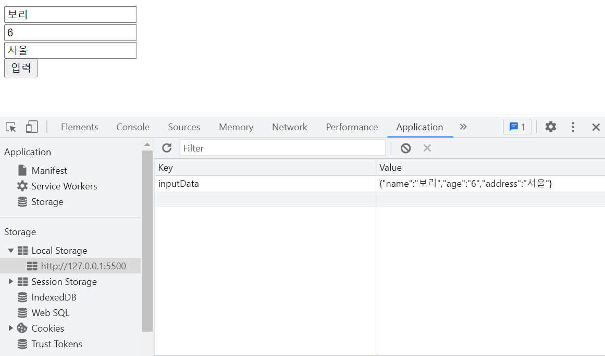

## 1) 웹 스토리지 (Web Storage)? 

- 브라우저 상에 데이터를 저장할 수 있는 기술

- `쿠키`의 단점 보완

  - 저장용량 문제 해결 (최대 5MB)
  - 요청시 Header에 자동으로 전송되지 않음 - 쿠키의 CSRF,  트래픽 문제 해결
  - 문자열 데이터 뿐 아니라 직렬화를 통해 객체 저장 가능 (아래에서 자세히)

  - 이전 포스팅 참조 - [화면이동과 상태유지 기법](https://hyemin-jang.github.io/Servlet%20&%20JSP/%ED%99%94%EB%A9%B4%EC%9D%B4%EB%8F%99%EA%B3%BC%20%EC%83%81%ED%83%9C%EC%9C%A0%EC%A7%80/)


### ✅ Local Storage

- 브라우저가 닫혀도(웹페이지의 세션이 끝나도) 데이터가 지워지지 않는다.

- 동일 컴퓨터, 동일 브라우저 내에서는 여러 탭 간에 데이터가 서로 공유된다.

- localStorage 객체의 메소드

  - `localStorage.setItem("key", value)` : 로컬스토리지에 key값으로 데이터 저장

  - `localStorage.getItem("key")` : 로컬스토리지로부터 key값으로 데이터 읽기

  - `localStorage.removeItem("key")` : 로컬스토리지에서 key값으로 저장된 데이터 삭제

  - `localStorage.clear()` : 로컬스토리지의 모든 데이터 삭제

    

### ✅ Session Storage

- 웹페이지의 세션이 끝날 때 저장된 데이터가 지워진다.
- 같은 웹사이트를 여러 탭에 띄우면 여러 개의 세션스토리지가 만들어져 데이터들이 각각 따로 저장되며, 탭을 닫으면 저장된 데이터가 소멸한다.
- 메소드 사용법은 로컬스토리지와 같다. 


### ⚡ 주의

웹스토리지에 데이터를 저장할 때는 **문자열**로 저장된다!! 

- 객체리터럴 혹은 JSON 데이터를 저장하려면 `JSON.stringify()` 함수를 통해 JSON 문자열 형태로 `직렬화`하여 저장한 후, 데이터를 활용할 때는`JSON.parse()` 함수를 통해 JSON 형태로 `역직렬화`하여 활용한다.

```html
<!DOCTYPE html>
<html lang="en">
<head>
    <meta charset="UTF-8">
    <meta http-equiv="X-UA-Compatible" content="IE=edge">
    <meta name="viewport" content="width=device-width, initial-scale=1.0">
    <title>Document</title>
</head>
<body>
    <div id="inputs">
        <input type="text" id="email" placeholder="이메일"><br>
        <input type="text" id="nickname" placeholder="닉네임"><br>
        <input type="text" id="age" placeholder="나이"><br>
    </div>
    <button id="btn">입력</button>

    <script>
        var obj = {};  // 객체리터럴 생성
        const inputs = document.getElementById('inputs').childNodes   
        myFunc = () => {
            inputs.forEach(v => {
                if(v.id){
                    obj[v.id] = v.value  // 객체리터럴에 값 저장
                }
            });
            localStorage.setItem("inputData", JSON.stringify(obj));  // 생성한 객체리터럴을 직렬화하여 로컬스토리지에 저장            
        }

        document.getElementById("btn").addEventListener('click', myFunc)  // 클릭 이벤트 발생시 로컬스토리지에 저장하는 함수 실행

        console.log(JSON.parse(localStorage.getItem("inputData")).name);  // 저장된 값을 JSON 형태로 역직렬화하여 활용
    </script>
</body>
</html>
```


개발자 도구에서 웹 스토리지에 저장되어 있는 데이터들을 확인할 수 있다.




