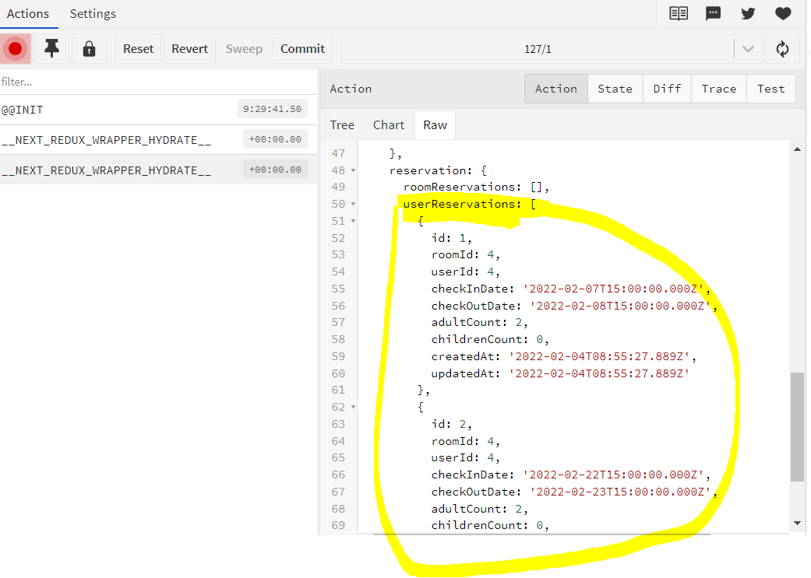
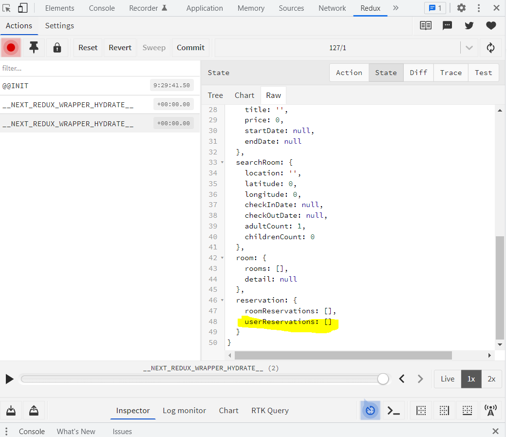
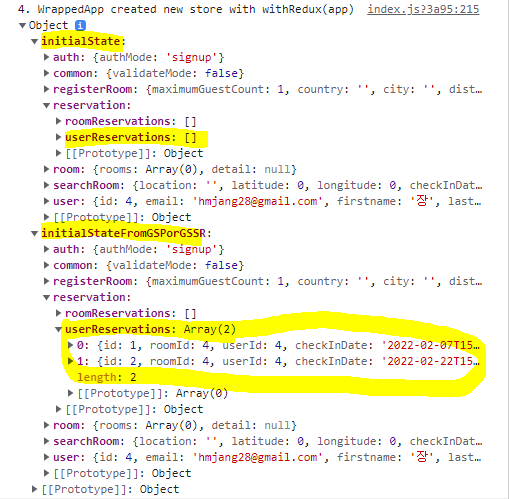

## Next.js의 Pre-rendering

Next.js는 React로 SSR(Server Side Rendering)을 가능하게 해주는 프레임워크이다.

페이지는 서버가 로드해주고, 페이지가 그려진 이후 페이지 내부에서 동적인 데이터를 fetch하는 과정은 CSR(Client Side Rendering) 방식을 따른다.

그렇기 때문에 **페이지가 로드될 때 데이터가 함께 fetch 되어야 하는 상황**이라면 Next.js가 제공하는 `getInitialProps`, `getStaticProps`, `getStaticPath`, `getServerSideProps` 를 이용해 첫 렌더링 때 데이터가 페칭될 수 있도록 처리해 주어야 한다.


## Next에서 Redux를 사용하려면?

- Next.js의 Pre-rendering을 가능하게 해주는 `getInitialProps`, `getServerSideProps` 등에서 store에 접근하기 위해

- 서버 측의 store와 클라이언트 측의 store를 합쳐 주기 위해

 **next-redux-wrapper** 라는 라이브러리가 필요하다.

<br>

✅ store/index.js

- `HYDRATE` action handler를 가지고 있는 리듀서 생성 - 서버측 store의 상태를 클라이언트 측 store에 합쳐주는 역할
- makeStore 함수 생성
- makeStore 함수를 인자로 받는 createWrapper 함수 export

```javascript
import { HYDRATE, createWrapper, MakeStore } from 'next-redux-wrapper';
import { configureStore, combineReducers } from '@reduxjs/toolkit';
import common from './common';
import searchSite from './searchRoom';
import user from './user';
import registerRoom from './registerRoom';
import auth from './auth';
import room from './room';
import reservation from './reservation';

//* redux-toolkit 의 combineReducers() 사용하여 여러 모듈화된 리듀서 합친 rootReducer 생성
const rootReducer = combineReducers({
	common: common.reducer,
	user: user.reducer,
	auth: auth.reducer,
	registerRoom: registerRoom.reducer,
	searchRoom: searchSite.reducer,
	room: room.reducer,
	reservation: reservation.reducer,
});

export type RootState = ReturnType<typeof rootReducer>; // 스토어의 타입 얻기
let initialRootState: RootState;

//* rootReducer에 타입이 __NEXT_REDUX_WRAPPER_HYDRATE__ 인 액션 추가 
const reducer = (state: any, action: any) => {
	if (action.type === HYDRATE) {     
        // 빈 초기상태라면 payload(=서버 측 store의 state)로 덮어씌워준다               
		if (state === initialRootState) {  
			return {
				...state,
				...action.payload,  
			};
		}
		return state;
	}
	return rootReducer(state, action);
};

//* 리덕스 store를 리턴하는 makeStore 함수 생성
const makeStore: MakeStore<any> = () => {
	const store = configureStore({
		reducer,
		devTools: true,
	});
	initialRootState = store.getState();
	console.log(store);
	return store;
};

//* 리덕스 스토어를 wrapper로 만들어서 export하기
export const wrapper = createWrapper(makeStore, { debug: true });

```

Next.js로 SSR을 하게 되면 사용자가 요청할 때마다 redux store를 새로 만들게 된다.

makeStore로 하나의 store를 다루도록 설정하여 클라이언트 단에서 redux store가 여러개 생성되는 것을 방지한다.


<br>

✅ pages/_app.tsx

- wrapper로 HOC 패턴으로 사용하여 App을 인자로 전달 => HYDRATE action type을 받을 수 있도록 한다 

```jsx
// Next 6버전 이후로 <Provider>로 감싸지 않아도 되도록 바뀜. 
const app = ({ Component, pageProps }: AppProps) => {
	return (
		<>
			<GlobalStyle />
			<Header />
			<Component {...pageProps} />
			<div id='root-modal' />
		</>
	);
};

export default wrapper.withRedux(app);
```


<br>


페이지가 `getStaticProps` 또는 `getServerSideProps`를 가지고 있으면 사용자가 해당 페이지를 요청할 때마다 **HYDRATE action**이 발생한다. 


> ### 💡 Hydrate?
>
> 넥스트가 서버 단에서 미리 pre-rendering한 HTML document를 클라이언트에게 전송한다. 그런데 이 때 클라이언트가 받은 웹페이지는 자바스크립트 요소들이 하나도 없는, 클릭 등의 이벤트 리스너들조차도 하나도 적용돼 있지 않은 상태이다. 
>
> 넥스트 서버가 pre-rendering 된 페이지를 보내고 나서, 바로 리액트가 번들링된 JS 코드를 클라이언트에게 전송한다. 그러면 이 JS 코드들이 이전에 보내진 HTML DOM 요소 위에서 한 번 더 렌더링을 하면서 자기 자리를 찾아가 매칭이 되는데, 이를 DOM 요소 위에 물을 채우듯 필요로 하던 요소들을 채운다 하여 **Hydrate**라고 부른다.


이 액션의 payload는 서버에서 static generation 또는 server side rendering이 발생할 때 생성한 state를 담고 있다. 그래서 **서버에서 생성한 state를 클라이언트 쪽에서도 사용할 수 있게 합쳐주는 (state reconciliation)** 역할을 한다.

참고로 페이지 레벨에서 `getServerSideProps` 또는 `getStaticProps`를 사용하면 App.getInitialProps도 무조건 발생해 HYDRATE action 이 두번 dispatch된다. 

(App.getInitialProps 직후의 state로 한번, getServerSideProps / getStaticProps 직후의 state로 한번)


<br>


## Issue1. 로그인 상태 유지하기

클라이언트 측 store는 각 페이지를 요청할 때마다 초기화되므로, 모든 페이지에서 로그인한 유저 정보를 유지할 수 있도록 **_app.tsx**에서 `getInitialAppProps`를 사용하였다.

쿠키에 access_token이 있다면 로그인한 유저 정보를 불러오는 api를 호출하고, 받은 데이터를 store에 저장하는 로직을 추가하여 모든 페이지 요청시마다 실행될 수 있도록 하였다. 

⚡ next-redux-wrapper 가 7버전으로 업데이트되면서  `getInitialProps`를 해당 상황에 적절한 wrapper로 감싸줘야 한다 :  `wrapper.getInitialAppProps` 또는 `wrapper.getInitialPageProps`를 사용한다.

⚡ 또한 `({store, req, res, ...}) => { ... }` 에서 `store => ({req, res, ...}) => { ... }` 와 같이 함수 사용법이 바뀌었다.

처음에 이거 몰라서 고생 많이함...

✅ pages/_app.tsx

```javascript
import App, { AppProps } from 'next/app';
import axios from '../lib/api';
import Header from '../components/Header';
import GlobalStyle from '../styles/GlobalStyle';
import { wrapper } from '../store';
import { cookieStringToObject } from '../lib/utils';
import { meAPI } from '../lib/api/auth';
import { userActions } from '../store/user';

const app = ({ Component, pageProps }: AppProps) => {
	return (
		<>
			<GlobalStyle />
			<Header />
			<Component {...pageProps} />
			<div id='root-modal' />
		</>
	);
};

app.getInitialProps = wrapper.getInitialAppProps((store) => async (context) => {
	const appInitialProps = await App.getInitialProps(context);
	const cookieObject = cookieStringToObject(context.ctx.req?.headers.cookie);
	const { isLogged } = store.getState().user;

	try {
		if (!isLogged && cookieObject.access_token) {
			axios.defaults.headers.cookie = cookieObject.access_token;
			const { data } = await meAPI();
			store.dispatch(userActions.setLoggedUser(data));
		}
	} catch (e) {
		console.log(e);
	}

	return { ...appInitialProps };
});

export default wrapper.withRedux(app);

```


## Issue2. 로그인한 사용자의 예약 내역 가져오기

로그인된 사용자의 user id를 가져오고, 해당 user id의 예약 내역을 가져와서 redux store에 저장하고, 컴포넌트에서 store에 저장된 값을 사용해서 렌더링을 해주고 싶었다.

처음에는 페이지에서 `getServerSideProps`를 사용하려고 했다. 그런데 `getServerSideProps` 함수 내에서 보낸 dispatch가 클라이언트 측 상태에 반영이 안 되는 문제가 있었다...

<br> 

✅ pages/reservation/index.tsx

```javascript
import React from 'react';
import { NextPage } from 'next';
import ReservationMain from '../../components/reservation/ReservationMain';
import { wrapper } from '../../store';
import { getUserReservationAPI } from '../../lib/api/reservations';
import { reservationActions } from '../../store/reservation';
import { cookieStringToObject } from '../../lib/utils';
import axios from '../../lib/api';

const index: NextPage = () => {
	return <ReservationMain />;
};

export const getServerSideProps = wrapper.getServerSideProps(
 	(store) =>
 		async ({ req, res, ...etc }) => {
 			const userId = store.getState().user.id;
 			try {
 				if (userId) {
 					const { data } = await getUserReservationAPI(userId);
 					store.dispatch(reservationActions.setUserReservations(data));
 				}
 			} catch (e) {
 				console.log(e);
 			}
 		}
 );

export default index;

```

(HYDRATE Action에 Payload로 들어간 것까진 확인됨)




(하지만 State에 반영 안됨... 왤까....?)



createWrapper 에 {debug : true}로 설정하고 콘솔에 찍힌 결과를 보면.. initialStateFromGSPorGSSR 이라는 곳에 들어가 있는데 이걸 어디서 어떻게 활용할 수 있는지 잘 모르겠다...



<br>

그래서 serverSideProps 대신에 `getInitialPageProps`를 사용해보려고 하니, user id를 받아오는 게 문제였다. page의 getInitialPageProps 가 _app의 getInitialProps보다 먼저 실행돼서 아직 로그인한 사용자 정보가 store에 들어가지도 않은 시점에서 접근해버린다. 

그래서.. 어쩔 수없이 여기에서도 로그인한 사용자 정보를 가져오는 api를 호출하는 방식으로 일단 해결은 했는데 ㅠ 이게 맞는 방법인지 모르겠다. 

```javascript
index.getInitialProps = wrapper.getInitialPageProps(
	(store) =>
		async ({ req, res, ...etc }) => {
			// const userId = store.getState().user.id;  불가
			const cookieObject = cookieStringToObject(req?.headers.cookie);
			const { isLogged } = store.getState().user;
			try {
				if (!isLogged && cookieObject.access_token) {
					axios.defaults.headers.cookie = cookieObject.access_token;
					// 로그인한 사용자 정보 호출
                    const userRes = await meAPI();
					const userId = userRes.data.id;
					
                    const { data } = await getUserReservationAPI(userId);
					store.dispatch(reservationActions.setUserReservations(data));
				}
			} catch (e) {
				console.log(e);
			}
		}
);
```


💛 피드백과 조언 부탁드립니다 💛


------

참고자료

https://github.com/kirill-konshin/next-redux-wrapper

https://helloinyong.tistory.com/315
