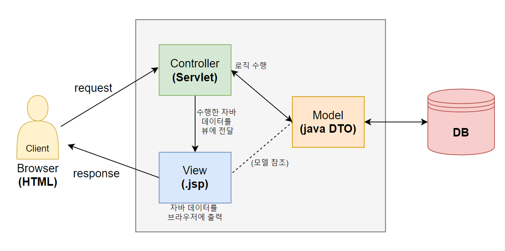

# 1. JSP란?

**Java Server Page**

HTML 코드에 JAVA 코드를 넣어 동적 웹 페이지를 생성할 수 있는 서버 사이드 언어(Web Container에서 실행되는 언어)

(참고: html / css / js는 client side 언어 - 서버 없이도 브라우저만 있으면 실행 가능)


⚡ **특징**

- 파일 확장자 : *.jsp
- jsp 파일을 클라이언트가 요청시에 **내부적으로 웹 컨테이너가 servlet으로 변환한다** .
  - 이후 컴파일 - byte code를 메모리에 로딩 - servlet 객체 생성, init() 호출, service() 호출 ... 등등 servlet 생명주기 똑같이 진행 (이전 포스팅 참고 - [Servlet](https://hyemin-jang.github.io/WEB/2.Servlet-%ED%99%94%EB%A9%B4%EC%9D%B4%EB%8F%99%EA%B3%BC%20%EC%83%81%ED%83%9C%EC%9C%A0%EC%A7%80/) )
  - 즉 jsp 파일은 servlet 파일과 같은 웹 요청/응답 처리 + HTML 파일과 같은 UI적 처리가 가능한 **presentation용 웹 개발 스펙**
- Servlet과 달리 jsp는 **내장 객체**가 있다 : 변수타입 변수명 선언해서 사용하는 것이 아니라 **변수명만 호출해서 사용 가능**
  - HttpServletRequest를 의미하는 `request`
  - HttpServletResponse를 의미하는 `response`
  - HttpSession을 의미하는 `session`
  - PrintWriter를 의미하는 `out` .. 등등

- jsp 파일에서는 html / css / javascript / 자바 데이터 핸들링하는 코드(java code, jsp tag)를 혼용해서 개발할 수 있다. 하지만!! **jsp 내에서는 가급적 순수 java code는 최소화하는 것을 권장!!**

  




## 1) JSP tag 종류

### (1) JSP scripting tag

가장 기초적인 JSP 태그. 총 5가지 종류가 있다.

- ⭐**주석** 

  ````
  <%-- 내용 --%>
  ````

- ⭐**지시자(directive)** : 인코딩 설정, 외부 자바 소스 import 

  ````
  <%@ 내용 %>
  ````

- **표현식(expression)** : 브라우저에 출력 

  ````
  <%= 내용 %>
  ````

- **선언자(declaration)** :  멤버변수 및 멤버메소드 구현 

  ```
  <%! 내용 %>
  ```

  

- **스크립트릿(scriptlet)** :  서비스 구현 (안에 자바 코드 그대로 작성) 

  ```
  <% 내용(자바코드) %>
  ```

  

    

✅ 이전 Servlet 포스팅에서 썼던 예제의 뷰 부분을 scripting tag를 사용해서 jsp 파일로 바꿔보자

<login.html>

```html
<!DOCTYPE html>
<html>
<head>
<meta charset="utf-8">
<title>login</title>
</head>
<body>
	<form action="check" method="post">
		<input type="text" name="id" value="abc"> <br>
		<input type="password" name="pw" value="123"> <br>
		<input type="submit" value="로그인">
	</form>

</body>
</html>
```


<Validation.java> - 서블릿 

```java
package controller;


import java.io.IOException;

import javax.servlet.ServletException;
import javax.servlet.annotation.WebServlet;
import javax.servlet.http.Cookie;
import javax.servlet.http.HttpServlet;
import javax.servlet.http.HttpServletRequest;
import javax.servlet.http.HttpServletResponse;
import javax.servlet.http.HttpSession;

@WebServlet("/check")
public class Validation extends HttpServlet {

	protected void service(HttpServletRequest request, HttpServletResponse response) throws ServletException, IOException {
		String id = request.getParameter("id");
		String pw = request.getParameter("pw");
		
		if(id.equals("abc") && pw.equals("123")) {  
			Cookie msg = new Cookie("name", "장보리");
			msg.setMaxAge(60*60*24*365);  
			response.addCookie(msg);
			
			response.sendRedirect("success.jsp");  // jsp파일로 이동
		
		} else {
			HttpSession session = request.getSession();
			session.setAttribute("failMsg", "인증 실패");
			
			// view라는 디렉토리 하단에 있는 fail.jsp 파일로 이동
            response.sendRedirect("view/fail.jsp");  
		}
	}

}
```


<success.jsp>

```html
<%@ page language="java" contentType="text/html; charset=UTF-8"
    pageEncoding="UTF-8"%>
<!DOCTYPE html>
<html>
<head>
<meta charset="UTF-8">
<title>Success</title>
</head>
<body>

<%
	Cookie [] all = request.getCookies();
	for(Cookie c : all) {
		if(c.getName().equals("name")) {
			out.println(c.getValue());
		}
	}	
	out.println("님 반갑습니다");
%>

</body>
</html>
```


<fail.jsp>

```html
<%@ page language="java" contentType="text/html; charset=UTF-8"
    pageEncoding="UTF-8"%>
<!DOCTYPE html>
<html>
<head>
<meta charset="UTF-8">
<title>Fail</title>
</head>
<body>

<!-- request에 setAttribute 하지 않았으므로 null 출력 -->
<%= request.getAttribute("failMsg") %><br> 
    
<!-- session에 저장한 데이터인 "인증 실패" 출력 -->
<%= session.getAttribute("failMsg") %><br>

<%
	session.invalidate();
	session = null;
%>
</body>
</html>
```


### (2) JSP Action tag

문법: `<jsp:태그종류 내용> `

여러가지가 있지만 가장 대표적으로

- forward 방식으로 화면 이동 

  - 출력은 최종 jsp 페이지의 내용만 됨
  - `request.getRepuestDispatcher("이동할페이지").forward(request, response)` 와 동일

  ```html
  <jsp:forward page="이동할페이지" />
  ```


- include 방식으로 화면 이동 

  - 이동 전/후
  - 
  -  모든 jsp페이지의 내용 출력
  - `request.getRepuestDispatcher("이동할페이지").include(request, response)` 와 동일

  ```html
  <jsp:include page="이동할페이지" />
  ```

  

### (3) ⭐ EL (Expression Language)

문법 : `${내용}` 

- 좀더 간편하게 **브라우저에 출력**을 지원하기 위한 태그
- { } 안에서 자바 코드를 실행
- 자바 코드를 최소화할 수 있음 - scripting, action 태그보다 발전된 태그

- null 인 경우 브라우저에 blank로 표시됨


✅ 위의 jsp scripting 태그를 가지고 만들었던 뷰 부분을 EL태그를 활용해 더 간결하게 만들어보자

<success.jsp>

```html
<%@ page language="java" contentType="text/html; charset=UTF-8"
    pageEncoding="UTF-8"%>
<!DOCTYPE html>
<html>
<head>
<meta charset="UTF-8">
<title>Success</title>
</head>
<body>

${cookie.name.value}

</body>
</html>
```


💜 EL태그는 쿠키 객체로부터 데이터 획득해서 출력시에 매우 유용하다!!!


<fail.jsp>

```html
<%@ page language="java" contentType="text/html; charset=UTF-8"
    pageEncoding="UTF-8"%>
<!DOCTYPE html>
<html>
<head>
<meta charset="UTF-8">
<title>Fail</title>
</head>
<body>
    
<!-- balnk 출력 -->
${requestScope.failMsg}<br>  

${sessionScope.failMsg}<br>  

<%
	session.invalidate();
	session = null;
%>
</body>
</html>
```

아까 scripting tag를 사용했을때와 달리, 출력값이 null인 경우 **null이 출력되는 대신에 아무것도 출력되지 않는다**는 차이가 있다.


✅ 다양한 타입의 자바 데이터를 EL태그를 사용해 브라우저에 출력해보자

```html
<%@ page import="model.domain.Person, java.util.ArrayList, java.util.HashMap"%>
<%@ page language="java" contentType="text/html; charset=UTF-8"
    pageEncoding="UTF-8"  %>
<!DOCTYPE html>
<html>
<head>
<meta charset="UTF-8">
<title>ELtagTest</title>
</head>
<body>
	<%
		String v1 = "string";
		request.setAttribute("v1", v1);
		
		String [] v2 = {"s1", "s2"};
		request.setAttribute("v2", v2);
		
		Person v3 = new Person("보리", 10);
		request.setAttribute("v3", v3);
		
		Person [] v4 = {new Person("리태1", 10), new Person("리태2", 20)};
		request.setAttribute("v4", v4);
		
		ArrayList<String> v5 = new ArrayList<>();
		v5.add("al1");
		v5.add("al2");
		request.setAttribute("v5", v5);
		
		ArrayList<Person> v6 = new ArrayList<>();
		v6.add(new Person("키위1", 10));
		v6.add(new Person("키위2", 20));
		request.setAttribute("v6", v6);
		
		HashMap<String, String> v7 = new HashMap<>();
		v7.put("key1", "value1");
		v7.put("key2", "value2");
		request.setAttribute("v7", v7);
	%>
	
	1. String 출력 : ${requestScope.v1} <br>
    
	2. String 배열 내의 데이터 출력 : ${requestScope.v2[0]} <br>
    
<!-- DTO 객체의 변수명으로 호출 가능 - 자동으로 get메서드 호출 (get메서드 없으면 정상실행 안됨) -->
	3. DTO 출력 : ${requestScope.v3.name} / ${requestScope.v3.age} <br>
    
	4. DTO 배열 내의 데이터 출력 : ${requestScope.v4[1].name} <br>
    
<!-- requestScope 혹은 sessionScope 생략 가능 / 리스트인데도 배열처럼 인덱스로 호출 -->
	5. List 내의 데이터 출력 : ${v5[1]} <br> 
    
	6. DTO List 내의 데이터 출력 : ${v6[1].name} <br>
    
	7. Map 내의 데이터 출력 : ${v7.key1} <br>
	
</body>
</html>
```


### (4) ⭐ JSTL (JSP Standard Tag Library)

- 순수 자바 코드를 jsp에서 최소화할 수 있는 발전된 태그

- 별도의 라이브러리로 제공됨
  - apache 사이트에서 다운로드 / 또는 각 서버마다 샘플이 있음
  - Tomcat 서버의 경우 `tomcat-9.0.52\webapps\examples\WEB-INF\lib` 안에 jar파일 2개가 들어있다
  
- jar 파일을 다이나믹 웹 프로젝트에서 `WebContent\WEB-INF\lib`폴더 내에 넣어야 사용 가능

- EL태그 혼용해서 개발한다.

- 문법 
  - jsp 파일 헤더에 **tablib 지시자** 추가 : 
  
    ````
    <% @taglib uri="http://java.sun.com/jstl/core" prefix="c" %>
    ````
  
  - jsp action 태그를 `<jsp:태그종류 내용>`와 같이 사용했던 것처럼, jstl 태그는 지정한 prefix인 c를 사용해서 로 `<c:태그종류 내용>` 과 같이 사용한다.
  
    ​	 
    
    
  
  

✅ JSTL core의 태그들

1. 조건문 : `if`

```html
<%@ page language="java" contentType="text/html; charset=UTF-8"
    pageEncoding="UTF-8"%>
<%@ page import="model.domain.Person, java.util.HashMap" %>
    
<%@ taglib prefix="c" uri="http://java.sun.com/jsp/jstl/core" %>

<!DOCTYPE html>
<html>
<head>
<meta charset="UTF-8">
<title>JSTLTest</title>
</head>
<body>

<c:if test="${1==1}">
	조건이 true니까 출력되는 문장! <br>
</c:if>
    
<c:if test="${1==2}">
	조건이 false니까 출력 안되는 문장! <br>
</c:if>

</body>
</html>
```


2. 다중 조건문 :  `when` (switch문과 비슷)

```html
<%@ page language="java" contentType="text/html; charset=UTF-8"
    pageEncoding="UTF-8"%>
<%@ page import="model.domain.Person, java.util.HashMap" %>
    
<%@ taglib prefix="c" uri="http://java.sun.com/jsp/jstl/core" %>

<!DOCTYPE html>
<html>
<head>
<meta charset="UTF-8">
<title>JSTLTest</title>
</head>
<body>

<c:choose>
	<c:when test="${1==1}">
		조건이 true니까 실행되는 문장<br>
	</c:when>
	<c:when test="${1==2}">
		조건이 false니까 실행 안되는 문장<br>
	</c:when>
	<c:otherwise>
		모든 조건식이 false인 경우 실행되는 문장
	</c:otherwise>
</c:choose>

</body>
</html>
```


3. 반복문 : `forEach`

```html
<%@ page language="java" contentType="text/html; charset=UTF-8"
    pageEncoding="UTF-8"%>
<%@ page import="model.domain.Person, java.util.HashMap" %>
 
<%@ taglib prefix="c" uri="http://java.sun.com/jsp/jstl/core" %>

<!DOCTYPE html>
<html>
<head>
<meta charset="UTF-8">
<title>JSTLTest</title>
</head>
<body>

1. 
<c:forEach begin="1" end="5" var="data">
	${data} 
</c:forEach>
<br>
    
2.
<c:forEach begin="10" end="20" step="2" var="data" varStatus="pd">
	순번 ${pd.count}- 데이터 ${data} <br>
</c:forEach>
<br>
    
3.
<%
Person [] arr = {new Person("보리", 1),
   				new Person("리태", 2),
   				new Person("키위", 3)};
request.setAttribute("arr", arr);

HashMap<String, String> map = new HashMap<>();
map.put("key1", "value1");
map.put("key2", "value2");
map.put("key3", "value3");
request.setAttribute("map", map);
%>
    
<c:forEach items="${arr}" var="data">
	이름: ${data.name} / 나이: ${data.age} <br>
</c:forEach>

<c:forEach items="${map}" var="data">
	key: ${data.key} / value: ${data.value} <br>
</c:forEach>


</body>
</html>
```


