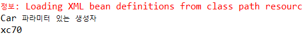
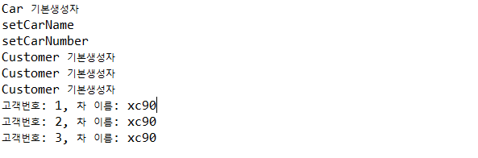

# 1. Spring?

: 자바 플랫폼을 위한 오픈 소스 프레임워크

💎 **특징**

- Enterprise Application에서 필요로 하는 기능 제공  : 고비용을 요하는 **WAS(Web Application Server)를 사용하지 않고도** WAS에서 지원하는 트랜잭션 관리, 보안, 객체 pooling과 같은 기술 사용 가능

- 경량 애플리케이션 컨테이너
- `Dependency Injection (DI, 의존성 주입)` 지원
- `Aspect Oriented Programming (AOP, 관점 지향 프로그래밍)` 지원
- `Plane Old Java Object (POJO = 순수 자바 클래스) 지원` :  일반 자바 클래스에 스프링을 붙여 개발 가능 - 특정 구현 기술에 종속적이지 않으므로 개발이 쉽고 개발 후 테스트도 빠르다
- 트랜잭션 처리를 위한 일관된 방법 제공
- 영속성 관련된 다양한 API 지원


## 1) 스프링 개발 환경

1. **Spring Tool Suite** 설치  - [다운로드 링크](https://github.com/spring-projects/toolsuite-distribution/wiki/Spring-Tool-Suite-3) (3.9.14 버전을 다운받았다)
2. 압축을 푼다 (반디집으로 푸는걸 추천!!)
3.  `sts-bundle\sts-3.9.14.RELEASE\STS.exe`를 실행하면 되는데.. 버전 관련 오류가 발생하며 실행되지 않았다.  같은 경로 내의 `STS.ini` 파일을 열어 `-Dosgi.requiredJavaVersion=` 부분에 `1.8`로 적어주니 해결되었다.
4. 스프링 프로젝트 생성 - Spring Legacy Project 가 정상적으로 생성되지 않을 때 방법
   - New - Java Project (일반 자바 프로젝트) 생성
   - 프로젝트 우클릭 - Configure - Convert to Maven Project
   - 프로젝트 우클릭 - Spring - Add Spring Project Nature
5. src 폴더 내에 xml 설정파일 추가
   - src 우클릭 - New - `Spring Bean Configuration File` 선택


# 2. Dependency Injection (DI, 의존성 주입)

Spring Framework가 지원하는 핵심 기능으로, 객체 사이의 의존 관계가 객체 자신이 아닌 **외부 조립기(= Spring Container)**에 의해 정의

✅ A라는 객체에서 B, C 객체를 사용(**= 참조 = `의존`**)할 때, A 객체에서 직접 생성하지 않고 **외부에서 생성된 B, C 객체를 주입해서 사용한다**. 이 역할을 **`Spring 컨테이너`**가 수행한다!


[이미지 출처] https://private.tistory.com/39


한 어플리케이션 내에는 수많은 객체가 존재하고 서로 참조하게 되는데,  의존 관계가 복잡해질수록 코드의 수정이 쉽지 않다

 => `DI`를 사용하면 설정 파일 내용만 바꿔주면 되기 때문에 **코드의 확장성 및 유지보수가 용이하다.**


## 1) Spring Container ( = IoC Container)

> 📦**Container**
>
> 보통 **인스턴스의 생명주기를 관리하고, 생성된 인스턴스들에게 추가적인 기능을 제공** 하는 것을 말한다. 
>
> 즉 개발자가 작성한 코드의 처리과정을 위임받은 독립적인 존재라고 이해하면 될 것 같다.

- 스프링 컨테이너는 **`Spring Bean`**의 생성, 관계 설정, 사용, 생명주기 관리 등을 관장한다.

- 설정 정보 파일인 xml파일을 읽어서 객체를 생성하고, 관계된 객체의 변수에 자동 대입해 주는 **조립기** 기능이 내장되어 있다.

    

  

>  🌱 **Spring Bean?**
>
> 여기서 Bean이란 반드시 DTO를 말하는 것이 아닌,  스프링이 관리하는 `모든 객체`를 의미한다.


> **IoC?**
>
> 


### (1) 스프링 컨테이너의 종류

- `BeanFactory` 
  - 설정정보인 xml 파일에 등록된 Bean 객체 생성 및 Bean 사이의 관계 설정 같은 기본적인 기능 제공
  - (일반적으로 스프링 프로젝트에서 직접 사용하는 일은 없다)
- `ApplicationContext`  
  - BeanFactory를 상속받은 하위 인터페이스 - **Bean 객체를 생성하고 관리**하는 기능 가지고 있다.
  - 뿐만 아니라 트랜잭션 관리, 메시지 기반의 다국어 처리, AOP 처리 등 많은 부분 지원
  - 컨텍스트 초기화 시점에 모든 싱글톤 빈을 미리 로드해놓기 때문에 애플리케이션 가동 후에는 빈을 지연없이 얻을 수 있다.
- `WebApplicationContext`
  - 스프링 애플리케이션에서 가장 많이 사용되는 컨텍스트로, 웹 어플리케이션을 위한 컨텍스트


## 2) 스프링의 DI 방법

### (1) Constructor Injection

의존하는 Bean 객체를 **생성자의 파라미터를 통해서 전달받는** 방식

⚡ 설정파일에 `<constructor-arg>` 태그 이용


1. **Spring Bean** 으로 활용될 POJO 클래스 생성

   <Car.java>

   ```java
   package model.domain;
   
   public class Car {
   	private String carName;
   	private int carNumber;
   	
   	public Car() {
   		System.out.println("Car 기본생성자");
   	}
   	
   	public Car(String carName, int carNumber) {
   		this.carName = carName;
   		this.carNumber = carNumber;
   		System.out.println("Car 파라미터 있는 생성자");
   	}
   	
   	public String getCarName() {
   		return carName;
   	}
   	public void setCarName(String carName) {
   		this.carName = carName;
   		System.out.println("setCarName");
   	}
   	public int getCarNumber() {
   		return carNumber;
   	}
   	public void setCarNumber(int carNumber) {
   		this.carNumber = carNumber;
   		System.out.println("setCarNumber");
   	}
   	
   }
   ```

   

   <Customer.java>

   ```java
   package model.domain;
   
   public class Customer {
   	private int id;
   	private Car car;  // Customer는 Car에 의존한다
   	
   	public Customer() {
   		System.out.println("Customer 기본생성자");
   	}
   		
   	public Customer(int id, Car car) {
   		System.out.println("Customer 파라미터 있는 생성자");
   		this.id = id;
   		this.car = car;
   	}
   	
   	public int getId() {
   		return id;
   	}
   	public void setId(int id) {
   		this.id = id;
   	}
   	public Car getCar() {
   		return car;
   	}
   	public void setCar(Car car) {
   		this.car = car;
   	}	
   	
   }
   
   ```

   

2. xml 설정파일 (Spring Bean Configuration File)에 Spring Bean 등록

   <context.xml>

   ```xml
   <?xml version="1.0" encoding="UTF-8"?>
   <beans xmlns="http://www.springframework.org/schema/beans"
   	xmlns:xsi="http://www.w3.org/2001/XMLSchema-instance"
   	xsi:schemaLocation="http://www.springframework.org/schema/beans http://www.springframework.org/schema/beans/spring-beans.xsd">
   
   	<!-- model.domain 패키지 내의 Car라는 POJO 클래스를 car라는 이름의 스프링 빈으로 등록 -->
   	<bean id="car" class="model.domain.Car" scope="singleton">    	
       	
       	<!-- 객체 생성시 멤버변수값 초기화에 파라미터가 있는 생성자 활용 -->
       	<constructor-arg name="carName" value="xc70"></constructor-arg>
       	<constructor-arg name="carNumber" value=10></constructor-arg>		
   	</bean>
           
   </beans>
   ```

   > 💡 **Bean 객체 범위**
   >
   > - `scope="singleton"` : 한 컨테이너에 static으로 객체 하나만 생성해서 사용  (생략시 기본이 singleton)
   > - `scope="prototype"` : 빈 요청시마다 새로운 객체 생성


3. main()에서 테스트

   <RunTest.java>

   ```java
   package running;
   
   import org.springframework.context.ApplicationContext;
   import org.springframework.context.support.ClassPathXmlApplicationContext;
   
   import model.domain.Car;
   
   public class Test {
   
   	public static void main(String[] args) {		
   		// ApplicationContext(spring container) 객체 생성
   		ApplicationContext context = new ClassPathXmlApplicationContext("context.xml");
   		
   		// getBean() : 스프링 컨테이너한테 객체 달라고 요청 
   		Car car = context.getBean("car", Car.class);  
   		
           System.out.println(car.getCarName());        
   	}
   
   }
   ```

   실행결과:

   

   파라미터가 있는 생성자가 호출된 것을 확인할 수 있다.

   

### (2) Setter Injection

의존하는 Bean 객체를 **set메소드**를 통해 전달받는 방식

⚡ 설정파일에 `<property>` 태그 이용


1. 위와 동일한 POJO 클래스 사용

2. 설정파일 등록

   <context.xml>

   ```xml
   <?xml version="1.0" encoding="UTF-8"?>
   <beans xmlns="http://www.springframework.org/schema/beans"
   	xmlns:xsi="http://www.w3.org/2001/XMLSchema-instance"
   	xsi:schemaLocation="http://www.springframework.org/schema/beans http://www.springframework.org/schema/beans/spring-beans.xsd">
   
   	<bean id="car" class="model.domain.Car">
           <!-- 멤버변수가 기본타입일때:  value 속성 사용-->
   		<property name="carName" value="xc90" />  
   		<property name="carNumber" value="20" />
   	</bean>
   	
   	<!-- scope="prototype" 설정을 통해 getBean() 요청시마다 다른 객체 생성 -->
   	<bean id="customer" class="model.domain.Customer" scope="prototype">        
           <!-- 멤버변수가 클래스형일때:  ref 속성 사용-->
   		<property name="car" ref="car"></property>		
   	</bean>
       
           
   </beans>
   ```

3. main() 에서 테스트

   ```java
   package running;
   
   import org.springframework.context.ApplicationContext;
   import org.springframework.context.support.ClassPathXmlApplicationContext;
   
   import model.domain.Customer;
   
   public class Test2 {
   
   	public static void main(String[] args) {
   		ApplicationContext context = new ClassPathXmlApplicationContext("context.xml");
   		
   		Customer cust1 = context.getBean("customer", Customer.class);
   		Customer cust2 = context.getBean("customer", Customer.class);
   		Customer cust3 = context.getBean("customer", Customer.class);
   		
   		cust1.setId(1);
   		cust2.setId(2);
   		cust3.setId(3);
   		
   		System.out.println("고객번호: " + cust1.getId() + ", 차 이름: " + cust1.getCar().getCarName());
   		System.out.println("고객번호: " + cust2.getId() + ", 차 이름: " + cust2.getCar().getCarName());
   		System.out.println("고객번호: " + cust3.getId() + ", 차 이름: " + cust3.getCar().getCarName());
   		
   	}
   
   }
   ```

   실행결과:

   

   - Car 객체가 먼저 생성되고 Customer 객체가 생상되었다 => 스프링 컨테이너가 의존관계를 파악해서 객체를 생성해줌
   - Car 객체의 멤버변수를 초기화할 때 set메서드가 사용되었다
   - Customer 빈을 scope="prototype"으로 지정했기 때문에 서로 다른 객체가 3개 생성되었다


## 3) Annotation 기반의 DI

> 💡 **@ (Annotation) 이란?**
>
> 메타데이터를 xml 등의 문서에 설정하는 것이 아니라 소스코드에 `@애노테이션`의 형태로 표현
>
> 클래스, 필드, 메소드의 선언부에 적용 가능
>
> 컴파일러가 실행되기 전에 애노테이션으로 설정한 내용대로 코드가 작성되었는지 확인하기 위해 실행됨
>
> 개발자가 설정파일에 작업하게 될 때 발생할 수 있는 오류의 발생 빈도를 낮추고 코드의 가독성 높일 수 있음


Spring Bean 객체 스캔을 위해 xml 문서와 같이 한 곳에 명시적으로 선언하지 않고, Bean으로 사용될 클래스에 애노테이션을 부여해주면 특정 애노테이션이 붙은 클래스를 찾아서 자동으로 Bean으로 등록해주는 방식

### `@Component`

- 해당 애노테이션이 붙은 클래스를 자동으로 빈으로 등록
- 클래스 선언구에 적용


### `@Required`

- Setter Injection 방식을 이용한 애노테이션
- 해당 setter 메소드 선언구에 설정
- xml 설정파일에 `<property>` 설정과 동일한 효과


### `@Autowired`

- **타입**을 기준으로 property 자동 설정하는 애노테이션
- 스프링 빈의 의존 관계를 자동 설정할 때 사용 
- = xml 설정파일의 `<bean class="패키지명.클래스명">` 설정과 동일한 효과


### `@Resource`

- **이름**을 기준으로 빈을 찾아 주입하는 애노테이션

### 


✅ 위의 xml 설정파일 기반의 예제를 애노테이션 기반으로 바꿔보자 

<context.xml>

```xml
<?xml version="1.0" encoding="UTF-8"?>
<beans xmlns="http://www.springframework.org/schema/beans"
	xmlns:xsi="http://www.w3.org/2001/XMLSchema-instance"
	xmlns:context="http://www.springframework.org/schema/context"
	xsi:schemaLocation="http://www.springframework.org/schema/beans http://www.springframework.org/schema/beans/spring-beans.xsd
		http://www.springframework.org/schema/context http://www.springframework.org/schema/context/spring-context-4.3.xsd">
	
	<!-- 애노테이션 사용하겠다는 설정 -->
	<context:annotation-config />
	
    <!-- 스프링빈으로 지정될 자바 클래스가 있는 패키지 지정 -->	
	<context:component-scan base-package="model.domain" />  
</beans>
```


<Car.java>

```java
package model.domain;

import org.springframework.context.annotation.Scope;
import org.springframework.stereotype.Component;

import lombok.AllArgsConstructor;
import lombok.Getter;
import lombok.NoArgsConstructor;
import lombok.Setter;


@NoArgsConstructor
@AllArgsConstructor
@Getter
@Setter

@Component   // = <bean id="car" class="model.domain.Car" />
@Scope("prototype")
public class Car {
	private String carName;
	private int carNumber;
}
```

<Customer.java>

```java
package model.domain;

import org.springframework.beans.factory.annotation.Autowired;
import org.springframework.stereotype.Component;

import lombok.AllArgsConstructor;
import lombok.Getter;
import lombok.NoArgsConstructor;
import lombok.Setter;

@NoArgsConstructor
@AllArgsConstructor
@Getter
@Setter

@Component
public class Customer {
	private int id;	
	
	@Autowired   // 타입을 기준으로 해당 타입에 맞는 스프링 빈 객체를 자동으로 적용    
	private Car car;	
}

```

