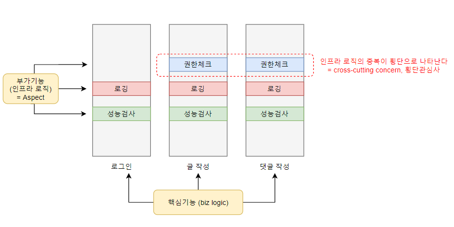
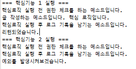

# AOP

**Aspect Oriented Programming**, 관점 지향 프로그래밍

> - `OOP(Object Oriental Programming, 객체 지향 프로그래밍)`의 핵심 단위는 `클래스`이다. 한 클래스가 단일 책임을 가지도록 분리한다.
> - AOP에서 핵심 단위는 `Aspect(관점, 관심사)`이다. 즉, **필수적이지만 어쩔 수 없이 반복적으로 사용되는 코드들을 분리**하여 모듈성을 증가시킨다.
> - AOP는 OOP의 단점(코드의 중복, 유지보수의 어려움, 재사용성 저하)를 보완해줄 수 있다. 


## 1) Aspect

#### `Aspect` 

로그기록, 성능측정, .. 등과 같은 **부가기능**이다.  즉 핵심 비즈니스 로직이 필요로 하는 **인프라 로직**이라고 생각하면 된다.

애플리케이션 전체에 걸쳐서 중복되어 사용되는 **공통기능**이다.

비즈니스 로직을 수행하는 데 있어 부가기능이 되는 인프라 로직의 중복이 횡단으로 나타나기 때문에 **cross-cutting concern(횡단 관심사)**라고 부른다.

​		  

#### 상황 가정

🙍‍♂️ :`로그인` 기능의 로그 기록 좀 해주세요

🙍‍♀️ : ㅇㅋ (그냥 회원가입 메소드에 로그기록을 하는 메소드를 추가하면 된다)

🙍‍♂️ : 잘했어요. 이제 어플리케이션 내의 1억 개의 메소드에 모두 로깅 추가해주세요

🙍‍♀️ : (도망간다)


👉 바로 이런 경우 도망가지 않고 **AOP 사용!**

- 핵심 관심 로직과 횡단 관심 로직(=공통 관심 로직)을 분리해서 각 모듈로 개발 - 이후 핵심 로직 코드의 수정 없이도 횡단 관심 로직을 적용하도록 할 수 있음




💎 `자바`에서 AOP라는 패러다임을 구현하는 구현체는 `AspectJ`이다.

Spring AOP는 AspectJ를 가져와서 사용한다.


## 2) AOP의 주요 개념


[이미지 출처] https://elevatingcodingclub.tistory.com/13


###  `Target`  

- 핵심 로직을 구현하는 클래스 = 비즈니스 로직

- 공통기능을 적용받게 되는 대상

  

### `Advice` 

- 공통기능을 언제 핵심 로직에 적용할지를 정의
- 스프링에서는 5가지 지점 가능
  - Before
  - After
  - AfterReturning
  - AfterThrowing
  - Around


### `JoinPoints`

- 연결점. Aspect를 적용할 수 있는 지점. Pointcut은 joinPoints의 부분집합임
- AspectJ에서는 메서드 호출, 메서드 실행, 필드, 객체, 생성자 등 다양한 JoinPoints가 구현돼있긴 하지만 스프링 AOP에서는 **메서드가 실행될 때** 만으로 한정되어 있다.

 

### `Pointcut` 

- 공통 관심 기능을 적용할 핵심로직의 **타겟 메소드**를 선택하는 지시자


### `Weaving` 

- 공통 관심 기능을 핵심 로직에 적용하는 것

- Weaving 방식 3가지
  - 컴파일 시점 : AOP가 적용된 새로운 클래스 파일이 생성됨 
  - 클래스 로딩 시점 : 로딩한 바이트코드를 AOP가 변경하여 사용
  - ⭐ **런타임 시점(Spring AOP에서 사용하는 방법)** : 소스코드나 클래스 정보 자체를 변경하지 않음. `Proxy 패턴`를 이용하여 AOP 적용한다.

  

> ### 💡 **Proxy 패턴 **
>
> Proxy는 '대리자'라는 뜻을 가지고 있다.
>
> 즉, 클라이언트가 사용하려고 하는 대상(타겟)을 대신해서, 실제 대상인 것처럼 위장해서 클라이언트의 요청을 받아주는 클래스이다.
>
> 클라이언트는 타겟을 직접 호출하는 게 아니라 Proxy를 호출하고, Proxy는 실제 클래스를 호출해서 실제 클래스에서 반환받은 값을 클라이언트에게 전달한다. 

- 즉 부가기능을 핵심로직에 해당하는 실제 클래스가 아니라 Proxy에 코딩할 수 있게 되는 것

- 스프링에서는 런타임시에 자동으로 프록시 객체를 생성한다.

  - `JDK Dynamic Proxy` : 타겟 대상이 인터페이스를 구현하는 클래스이면, 인터페이스를 기반으로 동적으로 프록시 객체를 생성한다.

  - `CGlib` : 타겟 대상이 인터페이스를 구현하고 있지 않는 클래스라면, CGlib를 통해서 클래스에 대한 프록시 객체를 생성한다. CGlib는 대상 클래스를 상속받아 구현한다.

    [참고한 블로그] https://mangkyu.tistory.com/m/175?category=761302


### 3) 실습 예제

글 작성과 댓글 작성 기능을 핵심 로직으로 하는 어플리케이션이 있다고 가정하자. (예제를 간단히 하기 위해 실제 기능을 1도 구현하지 않은 예제입니다)


<Biz.java>  : 핵심 로직이 구현된 클래스

```java
package biz;

public class Biz {	
	public String posting() {
		System.out.println("글 작성하는 메소드입니다. 핵심 로직입니다.");
		return "작성한 글";
	}
	
	
	public void comment(String name) throws Exception {
		if (name != "보리") {
			throw new Exception("예외를 발생시켜보겠습니다.");
		}else {
			System.out.println("댓글 작성하는 메소드입니다. 핵심 로직입니다.");
		}
	}
	
}
```


여기에 여러 부가 기능들을 적용시키려고 한다. 예제 코드에는 메소드가 2개밖에 없지만 메소드가 1억개쯤 있는 어플리케이션이라면 각 메소드마다 하나하나 부가기능을 추가하기 어려울 것이다. 필요한 부가기능들을 분리하여 Aspect로 개발한다.


#### ✅ XML 스키마 기반

아래와 같은 부가 기능들을 적용한다고 가정하자.

<Common.java> : 핵심로직 전반에 걸쳐 공통적으로 사용될 횡단 관심 기능들을 구현한 클래스

```java
package common;

public class Common {
	// 핵심로직 실행 전 실행될 부가기능
	public static void authCheck() {
		System.out.println("핵심로직 실행 전 권한 체크를 하는 메소드입니다.");
	}
	
	// 핵심로직 실행 후 실행될 부가기능
	public static String logging() {
		System.out.println("핵심로직 실행 후 로그 기록을 남기는 메소드입니다.");
		return "로그기록";
	}	
	
	// 핵심로직 메소드의 리턴값 반환 후 실행될 부가기능
	public static void afterReturn() {
		System.out.println("리턴되었습니다.");
	}	
	
	// 핵심로직에서 예외 발생시 실행될 부가기능
	public static void exception(Exception e) {
		System.out.println(e.getMessage());
	}
}

```


<config.xml>  : Spring Bean Configuration 파일

```xml
<?xml version="1.0" encoding="UTF-8"?>
<beans xmlns="http://www.springframework.org/schema/beans"
	xmlns:xsi="http://www.w3.org/2001/XMLSchema-instance"
	xmlns:aop="http://www.springframework.org/schema/aop"
	xmlns:context="http://www.springframework.org/schema/context"
	xsi:schemaLocation="http://www.springframework.org/schema/beans http://www.springframework.org/schema/beans/spring-beans.xsd
		http://www.springframework.org/schema/aop http://www.springframework.org/schema/aop/spring-aop-4.3.xsd
		http://www.springframework.org/schema/context http://www.springframework.org/schema/context/spring-context-4.3.xsd">

	<!-- AOP 사용을 위한 필수 설정 -->
	<aop:aspectj-autoproxy />

	<!-- Spring bean 등록 -->
	<bean id="biz" class="biz.Biz" />
	<bean id="common" class="common.Common" />
	
	<!-- AOP 설정 -->
	<aop:config>
		<!-- 핵심기능의 어느 메소드에 적용할지 포인트컷 지정 -->
		<aop:pointcut id="bizLogic" expression="execution(* biz.Biz.*(..))" />  <!-- biz 패키지 내 Biz 클래스의 모든 메소드(파라미터 무관)에 적용하겠다는 뜻 -->
		
		<!-- 공통기능(aspect) 지정 -->		
		<aop:aspect ref="common">
			<aop:before method="authCheck" pointcut-ref="bizLogic"/>  <!-- authCheck라는 공통기능을 before 시점에 bizLogic이라는 핵심기능에 적용하겠다 -->
			<aop:after method="logging" pointcut-ref="bizLogic"/>  
			<aop:after-returning method="afterReturn" returning="v" pointcut-ref="bizLogic"/>  
			<aop:after-throwing method="exception" throwing="e" pointcut-ref="bizLogic"/>
		</aop:aspect>
		
	</aop:config>			
</beans>
```


 

이와 같이 설정 후 메인 메소드에서 테스트해보자.

<AOPTest.java>

```java
package running;

import org.springframework.context.ApplicationContext;
import org.springframework.context.support.ClassPathXmlApplicationContext;

import biz.Biz;

public class AOPTest {

	public static void main(String[] args) {
		ApplicationContext context = new ClassPathXmlApplicationContext("config.xml");		
		Biz b = context.getBean("biz", Biz.class);
		
		System.out.println("=== 핵심기능 1 실행 ===");
		b.posting();
		
		System.out.println("=== 핵심기능 2 실행 ===");
		try {
			b.comment("리태");
		} catch (Exception e) {
			// TODO Auto-generated catch block
		}

	}

}
```

실행결과




before, after, throwing, returning을 모두 수용 가능한 `Around` Advice로 만들 수도 있다.

<Common.java>

```java
package common;

import org.aspectj.lang.ProceedingJoinPoint;

public class Common {	
	public Object aroundCommon(ProceedingJoinPoint point) { // ProceedingJoinPoint : around를 처리할 수 있게 하는 인터페이스
		// before
		System.out.println("핵심로직 실행 전 권한 체크를 하는 메소드입니다.");
	
		// 핵심로직 		
		Object v = null;
		try {
			v = point.proceed();  // proceed(): 실제 호출된 핵심로직 메소드 실행
		} catch (Throwable e) {
			// throwing
			System.out.println(e.getMessage());   // throwing
		}  
		
		// after & after returning
		System.out.println("핵심로직 실행 후 로그 기록을 남기는 메소드입니다.");
		System.out.println("리턴되었습니다.");
		
		return v;  // 핵심로직 실행결과값 반환
	}
}

```


<config.xml>

```xml
<?xml version="1.0" encoding="UTF-8"?>
<beans xmlns="http://www.springframework.org/schema/beans"
	xmlns:xsi="http://www.w3.org/2001/XMLSchema-instance"
	xmlns:aop="http://www.springframework.org/schema/aop"
	xmlns:context="http://www.springframework.org/schema/context"
	xsi:schemaLocation="http://www.springframework.org/schema/beans http://www.springframework.org/schema/beans/spring-beans.xsd
		http://www.springframework.org/schema/aop http://www.springframework.org/schema/aop/spring-aop-4.3.xsd
		http://www.springframework.org/schema/context http://www.springframework.org/schema/context/spring-context-4.3.xsd">

	<aop:aspectj-autoproxy />
	
	<bean id="biz" class="biz.Biz" />
	<bean id="common" class="common.Common" />	
	
	<aop:config>		
		<aop:pointcut id="bizLogic" expression="execution(* biz.Biz.*(..))" />  	
				
		<aop:aspect ref="common">			
			<aop:around method="aroundCommon" pointcut-ref="bizLogic" /> 
		</aop:aspect>
		
	</aop:config>			
</beans>
```


#### ✅ Annotation 기반

위 예제를 어노테이션을 사용하는 방식으로 바꿔보자.

<config.xml>

```xml
<?xml version="1.0" encoding="UTF-8"?>
<beans xmlns="http://www.springframework.org/schema/beans"
	xmlns:xsi="http://www.w3.org/2001/XMLSchema-instance"
	xmlns:aop="http://www.springframework.org/schema/aop"
	xmlns:context="http://www.springframework.org/schema/context"
	xsi:schemaLocation="http://www.springframework.org/schema/beans http://www.springframework.org/schema/beans/spring-beans.xsd
		http://www.springframework.org/schema/aop http://www.springframework.org/schema/aop/spring-aop-4.3.xsd
		http://www.springframework.org/schema/context http://www.springframework.org/schema/context/spring-context-4.3.xsd">

	<aop:aspectj-autoproxy />

	<!-- annotation 사용하겠다는 설정 -->
	<context:annotation-config />  
	
	<!-- 스프링빈으로 등록한 자바 클래스가 어느 패키지에 있는지 지정 -->
	<context:component-scan base-package="biz" /> 
	<context:component-scan base-package="common" />   	
</beans>
```


핵심 기능, 공통 기능 클래스에 `@Component` 어노테이션 붙여서 스프링빈으로 등록해주고, 공통 기능 클래스에 AOP로 등록하는 어노테이션을 붙여준다.

<Biz.java>

```java
package biz;

import org.springframework.stereotype.Component;

@Component
public class Biz {	
	public String posting() {
		System.out.println("글 작성하는 메소드입니다. 핵심 로직입니다.");
		return "작성한 글";
	}
	
	
	public void comment(String name) throws Exception {
		if (name != "보리") {
			throw new Exception("예외를 발생시켜보겠습니다.");
		}else {
			System.out.println("댓글 작성하는 메소드입니다. 핵심 로직입니다.");
		}
	}
	
}
```


<Common.java>

```java
package common;

import org.aspectj.lang.annotation.After;
import org.aspectj.lang.annotation.AfterReturning;
import org.aspectj.lang.annotation.AfterThrowing;
import org.aspectj.lang.annotation.Aspect;
import org.aspectj.lang.annotation.Before;
import org.springframework.stereotype.Component;

@Aspect
@Component
public class Common {
	@Before("execution(* biz.Biz.*(..))")
	public static void authCheck() {
		System.out.println("핵심로직 실행 전 권한 체크를 하는 메소드입니다.");
	}
	
	@After("execution(* biz.Biz.*(..))")
	public static String logging() {
		System.out.println("핵심로직 실행 후 로그 기록을 남기는 메소드입니다.");
		return "로그기록";
	}	
	
	@AfterReturning(pointcut="execution(* biz.Biz.*(..))", returning="v")
	public static void afterReturn() {
		System.out.println("리턴되었습니다.");
	}	
	
	@AfterThrowing(pointcut="execution(* biz.Biz.*(..))", throwing="e")
	public static void exception(Exception e) {
		System.out.println(e.getMessage());
	}

}

```


Around 를 사용할 경우

```java
package common;

import org.aspectj.lang.ProceedingJoinPoint;
import org.aspectj.lang.annotation.Around;
import org.aspectj.lang.annotation.Aspect;
import org.springframework.stereotype.Component;

@Aspect
@Component
public class Common {	
	@Around("execution(* biz.Biz.*(..))")
	public Object aroundCommon(ProceedingJoinPoint point) { 		
		// before
		System.out.println("핵심로직 실행 전 권한 체크를 하는 메소드입니다.");
	
		// 핵심로직 		
		Object v = null;
		try {
			v = point.proceed();  
		} catch (Throwable e) {
			// throwing
			System.out.println(e.getMessage());   // throwing
		}  
		
		// after & after returning
		System.out.println("핵심로직 실행 후 로그 기록을 남기는 메소드입니다.");
		System.out.println("리턴되었습니다.");
		
		return v; 
	}
}
```

