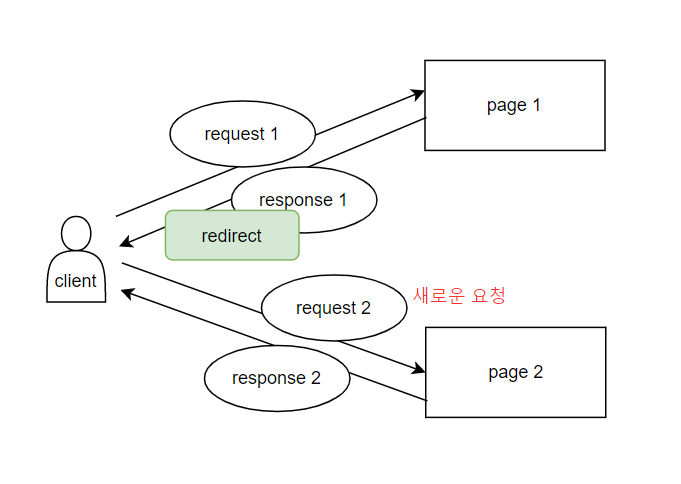

# 1. Server & Client 개요

### 💎 웹 서비스 구조


[이미지 출처] https://gmlwjd9405.github.io/2018/10/27/webserver-vs-was.html


- `Web Server` 
  - **정적 컨텐츠**(HTML, CSS, image 등) 제공 
  - 동적 컨텐츠 제공을 위해 클라이언트의 요청을 WAS에 전달, WAS가 처리한 결과를 클라이언트에게 응답
- `WAS(Web Application Server)` 
  - parameter의 내용에 따라 다양한 로직 처리(DB조회 등)를 수행하여 **동적 컨텐츠** 제공
  - `Web Container` 라고도 한다.


- ⚡ **Web Server와 WAS를 함께 사용하는 이유**

  - 정적 컨텐츠 제공 / 동적 컨텐츠 제공 기능 분리하여 서버 부하 방지

  - WAS는 외부와 간접적으로 연결됨 - 보안을 고려해야 하는 파일 및 리소스를 안전하게 보호

  - 여러대의 WAS 연결하여 수많은 요청을 분산해서 안정적으로 운영할 수 있는데, 이 때 Web Server가 Load Balancing 역할 수행해준다.
  - ***Web Server를 WAS 앞에 두고, 필요한 WAS들을 Web Server에 플러그인 형태로 설정하면 더욱 효율적인 분산 처리가 가능하다.***


--------------


# 2. Servlet

## 1) **Servlet이란?**

**클라이언트의 요청을 처리하고 그 결과를 반환하는, Servlet 클래스의 구현규칙을 지킨 자바 웹 프로그래밍 기술**

- 원칙적으로는 `javax.servlet.Servlet` 인터페이스를 구현한 것이다.

- 클라이언트의 요청에 대해 웹서버가 동적인 페이지를 제공할 수 있도록 해주는 자바 클래스이다.

- 자바로 구현된 CGI라고도 한다.

  > 💡 CGI (Common GateWay Interface)
  >
  > : 웹서버와 외부 프로그램 사이에서 정보를 주고받는 방법이나 규약

- MVC 패턴에서 Controller로 이용된다.

### 🌈 Servlet Container

**WAS(Web Application Server) 중 Servlet API를 지원하는 것.** 

클라이언트의 요청/응답을 처리하기 위해 **서블릿을 관리하고 동작시킬 수 있는 환경을 제공**하는 서버 프로그램으로,  주된 역할은 다음과 같다.

- 통신 지원 
  - 웹 서버와 서블릿이 통신하는 과정(소켓 만들고, 특정 포트를 리스닝하고, 스트림 생성 등등..)을 알아서 제공한다.
- 생명주기 관리 
  - 아래 `Servlet LifeCycle`에서 자세히 설명
- 멀티스레딩 관리 
  - 클라이언트 최초 요청시 서블릿 생성 후, 이미 생성된 서블릿에 대한 요청은 스레드를 생성해 실행한다. (아래 `Servlet과 객체 생성` 에서 자세히 설명) 
  - 즉, 동시에 여러 요청이 들어오면 멀티스레딩 환경으로 동시다발적인 작업을 관리한다.
- 보안관리 
  - 보안 관련된 기능을 지원하므로 서블릿 코드 안에 보안 관련 메소드를 구현하지 않아도 된다.
- JSP 지원


### 🐱 이클립스에서 **Tomcat** 사용하기

Apache Tomcat은 대표적인 서블릿 컨테이너이다.

1. Tomcat  [9버전 다운로드](https://tomcat.apache.org/download-90.cgi#9.0.52)

2. 환경변수 설정

   - 시스템변수 Path 편집 - tomcat\bin 까지의 경로 등록 (jdk 아래에 위치)

   - 시스템 변수 새로만들기 - 이름 CATALINA_HOME 설정,  tomcat까지의 경로 등록


 

3. 이클립스에서 File - New - Server 선택 후 Tomcat 선택


4. 이제 상단 메뉴에서 초록색 run 버튼을 눌러 tomcat 서버를 실행할 수 있다. 혹시 기본 포트번호인 80을 다른 무언가가 사용하고 있어 실행이 안된다면 server.xml 파일을 열어서 포트번호를 수정하자 (나는 8088번으로 함)


> ⚡ **서블릿 활용 이클립스의 다이나믹 웹프로젝트 개발구조**
>
> - src 폴더 내
>   - 순수 DAO, DTO 등등.. 일반 모든 자바 소스 위치
>   - http 기반으로 요청/응답 처리하는 Servlet 파일 위치
>
> - WebContent 폴더 내
>   - *.html / *.css / *.js / 이미지, 동영상 ... / *.jsp 등 위치


## 2) Servlet의 동작 방식


[이미지 출처] https://mangkyu.tistory.com/14

### 🌟 Servlet과 객체 생성

- **Servlet 객체**는 **최초의 클라이언트 요청시 단 한번만 생성**된다.
  - 서블릿 객체 수 : 요청한 클라이언트 수 = `1 : N`

- **deGet() / doPost() 메소드**는 **클라이언트 요청 수만큼 실행**된다.

  => 하나의 프로세스 내에 여러 스레드로 개별 실행 = `멀티스레딩`

  - deGet() / doPost() 메소드 수 : 요청한 클라이언트 수 = `1 : 1`

  - doGet() / doPost()는 parameter로 개별 HttpServletRequest, HttpServletResponse를 받는다
  - client 한 명당 1:1로 HttpServletRequest 객체와 HttpServletResponse 객체가 자동 생성된다 - client 간에 공유되지 않고 개별적으로 할당됨


## 3) Servlet LifeCycle


1. 기본생성자

   - 최초 클라이언트가 호출시 실행되서 객체 생성
   - 서블릿 파일 혹은 jsp 파일이 수정되면 기존 서블릿 자원을 해제시킨 뒤 새로 객체 생성

2. init()

   - 생성자 호출(객체 생성) 직후에 단 한번 실행
   - 공유하는 자원 초기화하는 로직 개발하기에 적합

3. deGet() / doPost()

   - 클라이언트 요청시 1:1 실행
   - 요청 방식에 따라 doGet() 또는 doPost() 실행

4. destroy()

   - 서블릿 파일을 수정하여 갱신된 servlet bytecode가 서버 메모리에 로딩시 자동 호출, 자동으로 구버전 객체 메모리 해제
   - 자원 반환용 로직 구현하기에 적합

   

## 4) Servlet API


### (1) HttpServlet

HTTP 프로토콜을 지원해주는 클래스이다. 

일반적으로 서블릿이라 하면 대부분 `javax.servlet.http.HttpServlet`를 상속받은 것을 의미한다.  HttpServlet은 GenericServlet을 상속받아 추상 메서드인 service를 HTTP 프로토콜 요청 메서드에 적합하게 구현한 것이다.

처리하고자 하는 방식 (method)에 따라 알맞은 메소드를 오버라이딩해서 구현한다.

✨ **메소드**

- `doGet()` :  get방식으로 처리시 사용한다. HttpServletRequest와 HttpServletResponse 두 파라미터를 갖는다. 
- `doPost()` : post방식으로 처리시 사용한다. HttpServletRequest와 HttpServletResponse 두 파라미터를 갖는다. 
- `service()` : 서블릿이 초기화된 후 클라이언트로부터 온 요청에 대한 서비스 수행 (get/post 방식 관계없이)


### (2) HttpServletRequest

http 프로토콜 기반으로 클라이언트의 request 정보를 서블릿에게 전달하기 위한 클래스이다.

ip, 브라우저 기본정보, 클라이언트가 서버에 전송하는 입력 데이터 등등의 정보를 담고 있다.

✨ **메소드**

- `setCharacterEncoding()` : 클라이언트 request로 들어오는 데이터의 포맷 및 인코딩 설정 
  - 한글 인코딩 설정시 - ```request.setCharacterEncoding("utf-8");```
- `String getParameter(name)` : 클라이언트가 입력한 데이터 획득 (파라미터로 input의 name 속성값을 받아 해당 value를 얻음)
- `String [] getParameterValues(name)` : value값이 여러개일때 value들을 배열 형태로 받음

- `getRequestQueryString()` : 클라이언트가 서버에 전송하는 map 구조의 데이터 (= `query`) 을 받아옴
- `setAttribute(key, value)` :   request 객체에 map 구조로 데이터 저장 (key에  저장할 데이터인 value 매핑)

> 💡 참고: url의 형식
>
> http://ip:port/project명/file명?key1=value1&key2=value2 ...
>
> 여기서 key1=value1&key2=value2 ... 부분을 `query`라고 함


### (3) HttpServletResponse

http 프로토콜 기반으로 클라이언트 브라우저에게 응답하기 위한 클래스이다.

✨ **메소드**

- `setContentType() `: 클라이언트 브라우저에 응답하는 데이터의 포멧 및 인코딩 설정
  - 한글 인코딩 설정시 - `response.setContentType("text/html;charset=utf-8");`
- `getWriter()` : 2byte 출력 가능한 PrintWriter 객체 생성
- `sendRedirect()` : redirect 방식으로 화면 이동 


```java
```


---------------

# 3. 화면이동 기법

## 1) GET vs POST

웹브라우저는 get과 post 두 방식 중 한가지를 이용해서 파라미터를 전송한다.

- `GET` 방식
  - url에 전송되는 데이터 값이 오픈된다
  - (보안과 관계 없는) 소량의 데이터 전송, web page 구분용으로 사용 

- `POST` 방식

  - 우편을 편지봉투에 넣어서 보내듯, 전송값을 은닉하여 전송

  - 보안이 필요한 경우(예: id 및 pw 제출), 전송하는 데이터 양이 많은 경우 사용

    

## 2) 화면 이동 방법 1 - HTML 활용

HTML 태그를 활용해 화면을 전환하면 URL도 변경된다 ( => redirect 방식)

- 버튼 : `<button onclick="location.href='이동할페이지'"></button>`  => **GET 방식**

- form 태그 내의 submit 버튼 : 

  - ```html
    <form action="이동할페이지" method="post">
            <input type="text" name="id" value="abc">
            <input type="password" name="pw" value="123">
            <input type="submit">    
    </form>
    ```

  - form 태그 내부의 모든 input 데이터를 form의 action 속성에 지정한 곳으로 전송
  - **method="post" 명시하면 POST방식**으로 전송 / **default는 GET방식**

- 링크 : `<a href="이동할페이지">`  => **GET방식**


## 3) 화면 이동 방법 2 - Servlet API 활용

### (1) Forward

- web container 차원에서의 페이지 이동 (웹 브라우저는 이동했는지 알수 없음)
- 따라서 웹브라우저 상에는 최초에 호출한 URL만 표시됨
- **요청 정보를 그대로 전달함** 
  - 시스템에 변화가 생기지 않는 단순 조회 요청(글 목록 보기, 검색)에 이용하는 것이 적절

```java
request.getRequestDispatcher("이동할페이지").forward(request, response);
```


### (2) Redirect

- URL 자체를 변경하는 기술
- **Request, Response 객체를 새롭게 생성**
  - 시스템에 변화가 생기는 요청(글쓰기, 회원가입 등)에 이용하는 것이 적절
  - 예를 들어 블로그 글쓰기 기능 수행시, redirect 방식으로 응답 페이지를 불러야 새로고침을 눌러도 같은 게시물이 여러번 등록되지 않음

```java
response.sendRedirect("이동할페이지");
```




