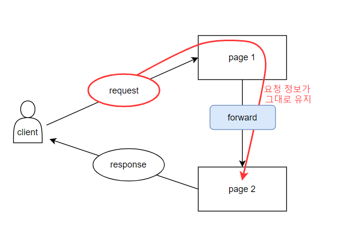
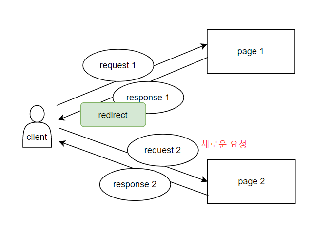
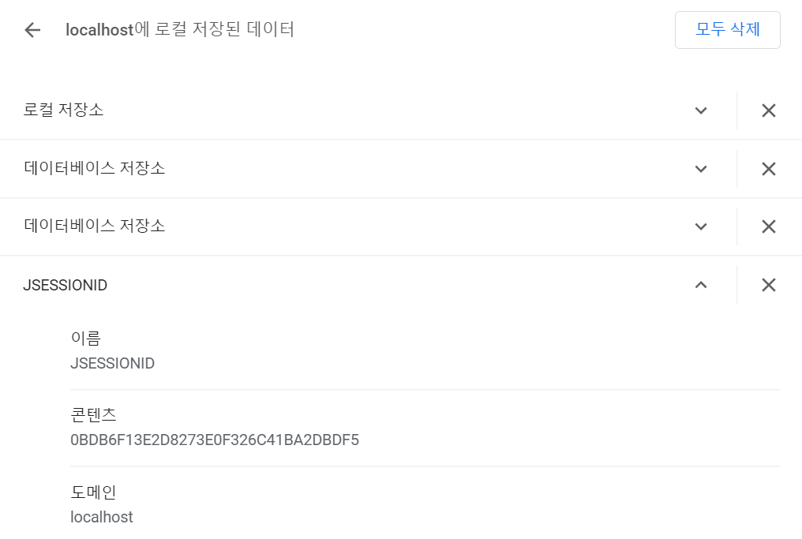

## 화면이동 기법

### 1) 화면 이동 방법 1 - HTML 활용

- 버튼 : `<button onclick="location.href='이동할페이지'"></button>` 

- form 태그 내의 submit 버튼 : 

  - ```html
    <form action="이동할페이지" method="post">
            <input type="text" name="id" value="abc">
            <input type="password" name="pw" value="123">
            <input type="submit">    
    </form>
    ```

  - form 태그 내부의 모든 input 데이터를 form의 action 속성에 지정한 곳으로 전송

  - **method="post" 명시하면 POST방식**으로 전송 / **default는 GET방식**

- 링크 : `<a href="이동할페이지">` 


<br>

### 2) 화면 이동 방법 2 - Servlet API 활용

#### (1) Forward

- web container 차원에서의 페이지 이동 (웹 브라우저는 화면 이동했는지 알지 못함)
- 따라서 웹브라우저 상에는 최초에 호출한 URL만 표시됨
- **요청 정보를 그대로 전달함** 
  - 시스템에 변화가 생기지 않는 단순 조회 요청(글 목록 보기, 검색)에 이용하는 것이 적절

```java
request.getRequestDispatcher("이동할페이지").forward(request, response);
```



#### (2) Redirect

- URL 자체를 변경하는 기술
- **Request, Response 객체를 새롭게 생성**
  - 시스템에 변화가 생기는 요청(글쓰기, 회원가입 등)에 이용하는 것이 적절
  - 예를 들어 블로그 글쓰기 기능 수행시, redirect 방식으로 응답 페이지를 불러야 새로고침을 눌러도 같은 게시물이 여러번 등록되지 않음

```java
response.sendRedirect("이동할페이지");
```



## 상태유지 기술

페이지를 이동해도 정보를 유지할수 있게 하는 기술

> 💡 HTTP의 기본 특성
>
> - 무상태성
> - 비연결성
>
> 클라이언트와 서버가 한번 연결을 맺은 뒤, 요청과 응답이 끝나고 연결이 끊기면  상태가 유지되지 않는 특성이 있다.  


### 1) Cookie

상태정보를 **client system에 저장**하여 유지하는 기술

- text에 한해서만 저장 (최대 4KB의 문자열)
- 타 벤더사 브라우저 사용시 쿠키 정보는 브라우저 내부의 메모리에만 저장 가능
- ⚡ 주의!! 보안을 고려한 중요한 데이터는 쿠키 활용하면 안됨!! 


<br>

✅ **쿠키 생성 및 사용 실습**

<login.html>

```html
<!DOCTYPE html>
<html>
<head>
<meta charset="utf-8">
<title>Insert title here</title>
</head>
<body>
	<form action="check" method="post">
		<input type="text" name="id" value="person"> <br>
		<input type="password" name="pw" value="123"> <br>
		<input type="submit" value="로그인">
	</form>

</body>
</html>
```


<Validation.java>

```java
package controller;

import java.io.IOException;

import javax.servlet.ServletException;
import javax.servlet.annotation.WebServlet;
import javax.servlet.http.Cookie;
import javax.servlet.http.HttpServlet;
import javax.servlet.http.HttpServletRequest;
import javax.servlet.http.HttpServletResponse;

@WebServlet("/check")
public class Validation extends HttpServlet {

	protected void service(HttpServletRequest request, HttpServletResponse response) throws ServletException, IOException {
        
        String id = request.getParameter("id");
        String pw = request.getParameter("pw");
        
        if(id.equals("abc") && pw.equals("123")) {            
            // 쿠키생성 - "name"이라는 key로 "hyem" 매핑
            Cookie msg = new Cookie("name", "hyem");
            // 클라이언트 시스템에 저장하고자 하는 시간을 초단위로 설정
            msg.setMaxAge(60*60*24*365);  // (1년으로 설정)
            // 클라이언트 시스템에 전송해서 저장
            response.addCookie(msg);
            
            response.sendRedirect("success");
        
        } else {
            request.setAttribute("failMsg", "인증 실패");
            request.getRequestDispatcher("view/fail").forward(request, response);
        }
    }

}
```


<Success.java>

```java
package view;

import java.io.IOException;
import java.io.PrintWriter;

import javax.servlet.ServletException;
import javax.servlet.annotation.WebServlet;
import javax.servlet.http.Cookie;
import javax.servlet.http.HttpServlet;
import javax.servlet.http.HttpServletRequest;
import javax.servlet.http.HttpServletResponse;

@WebServlet("/success")
public class Success extends HttpServlet {
    protected void service(HttpServletRequest request, HttpServletResponse response) throws ServletException, IOException {
        response.setContentType("text/html;charset=utf-8");
        PrintWriter out = response.getWriter();
        
        // 클라이언트 시스템에서 해당 도메인의 쿠키정보 획득
        Cookie [] all = request.getCookies();
        for(Cookie c : all) {
            if(c.getName().equals("name")) {
                out.println(c.getValue());
            }
        }
        out.println("반갑습니다");
    }

}
```


<Fail.java>

```java
package view;

import java.io.IOException;
import java.io.PrintWriter;

import javax.servlet.ServletException;
import javax.servlet.annotation.WebServlet;
import javax.servlet.http.HttpServlet;
import javax.servlet.http.HttpServletRequest;
import javax.servlet.http.HttpServletResponse;

@WebServlet("/view/fail")
public class Fail extends HttpServlet {
	protected void service(HttpServletRequest request, HttpServletResponse response) throws ServletException, IOException {
        response.setContentType("text/html;charset=utf-8");
        PrintWriter out = response.getWriter();
        out.println(request.getAttribute("failMsg"));  // 인증 실패 출력
    }
    
}
```


🍪 **쿠키의 종류**

- 만료 기간에 따라

  - 영구 쿠키(Persistent Cookie) : 만료 기간이 끝나면 삭제
  - 세션 쿠키(Session Cookie) : 브라우저 종료시 삭제

- 생성된 도메인에 따라

  - 퍼스트파티 쿠키(First party Cookie) : 같은 도메인/서브도메인에서 생성된 쿠키
  - 서드파티 쿠키(Third party Cookie) : 다른 도메인에서 생성된 쿠키 
  - A 도메인에 접속했을 때, A 도메인 내에서 B 도메인으로 요청을 하는 경우(스크립트, 이미지, 폰트, 아이프레임 등)가 존재하는 경우 서드파티 쿠키(B도메인의 쿠키)가 생성된다 
  - 서드파티 쿠키는 주로 광고 목적으로 활용

  

  

🤔 **쿠키의 문제점**

- 보안상 문제 : 쿠키가 자동으로 전송된다는 특징을 이용, 사용자에게 악성 스크립트를 실행시킬 수 있음)
  - CSRF - 사용자의 권한을 이용한 공격 (로그인된 사용자의 비밀번호 변경, 결제요청 등)
  - XSS - 사용자의 토큰과 같은 민감한 정보 탈취
- 부족한 저장 용량
- 불필요한 트래픽 증가 (HTTP 요청 시 자동으로 모든 쿠키 전송하기 때문에)


<br>

### 2) Session

상태정보를 **server system**에 저장하여 유지하는 기술

- 클라이언트 시스템에 저장하는 쿠키보단 보안 고려 / 안정적

- 하지만 클라이언트가 많아질수록 서버 부하 야기 - 다른 상태 유지 기술(토큰...)과 적절히 혼용해야 함

  ​	 

<br>

✅ **세션 생성 및 사용 실습**

아까 위의 실습 코드에서는 request 객체에 fail message를 저장하고, Validation.java에서 Fail.java로 넘어갈 때 `forward` 방식을 사용해서 request 정보를 그대로 유지시켰다. 하지만 만약 `redirect` 방식으로 화면 이동을 했다면 저장한 fail message 정보가 휘발되었을 것이다.

session을 사용해서 정보를 유지시켜보자.

```java
package controller;

import java.io.IOException;

import javax.servlet.ServletException;
import javax.servlet.annotation.WebServlet;
import javax.servlet.http.Cookie;
import javax.servlet.http.HttpServlet;
import javax.servlet.http.HttpServletRequest;
import javax.servlet.http.HttpServletResponse;
import javax.servlet.http.HttpSession;

@WebServlet("/check")
public class Validation extends HttpServlet {
    protected void service(HttpServletRequest request, HttpServletResponse response) throws ServletException, IOException {
        String id = request.getParameter("id");
        String pw = request.getParameter("pw");
        
        if(id.equals("abc") && pw.equals("123")) {
            Cookie msg = new Cookie("name", "hyem");
            msg.setMaxAge(60*60*24*365);
            response.addCookie(msg);
            
            response.sendRedirect("success");
        
        } else {
            // redirect 방식은 화면이동시 request값 소멸 - session 생성하자!
            // 클라이언트가 최초 요청이면 Session ID 생성, ID가 이미 있다면 재사용하는 코드임
            HttpSession session = request.getSession();
            session.setAttribute("failMsg", "인증 실패");
            
            response.sendRedirect("view/fail");
        }
    }

}
```


✅ 세션 생성시 클라이언트 시스템에는 **세션쿠키**가 생성된다!

크롬 브라우저의 `설정`에서 `모든 쿠키 및 사이트 데이터 보기`에 들어가면, localhost에 `JSESSIONID` 라는 이름의 쿠키가 생성된 것을 볼 수 있다. 



- 세션은 브라우저당 하나씩 생성된다.

- ` HttpSession session = request.getSession();` 코드는
  - 클라이언트가 최초 요청 시 - Session ID 생성 
  - 같은 클라이언트가 다시 다른 요청 시 - 해당 세션 아이디를 활용
- 결과적으로 웹 컨테이너는 클라이언트 브라우저에 쿠키로 저장한 JSSESSIONID로 클라이언트 브라우저들을 구분한다.


<Fail.java>

```java
package view;

import java.io.IOException;
import java.io.PrintWriter;

import javax.servlet.ServletException;
import javax.servlet.annotation.WebServlet;
import javax.servlet.http.HttpServlet;
import javax.servlet.http.HttpServletRequest;
import javax.servlet.http.HttpServletResponse;
import javax.servlet.http.HttpSession;

@WebServlet("/view/fail")
public class Fail extends HttpServlet {
    protected void service(HttpServletRequest request, HttpServletResponse response) throws ServletException, IOException {
        response.setContentType("text/html;charset=utf-8");
        PrintWriter out = response.getWriter();
        
        // 세션 생성(X), 이미 이 클라이언트 시스템에서 JSESSIONID값 만들어져 있기 때문에 재사용(O)
        HttpSession session = request.getSession();
        out.println(session.getAttribute("failMsg"));
        
        // 더이상 세션 사용 안하는 상황(로그아웃)이라 가정 - 자원해제 해서 메모리 절약 필수
        session.invalidate();
        session = null;
    }
    
}
```

